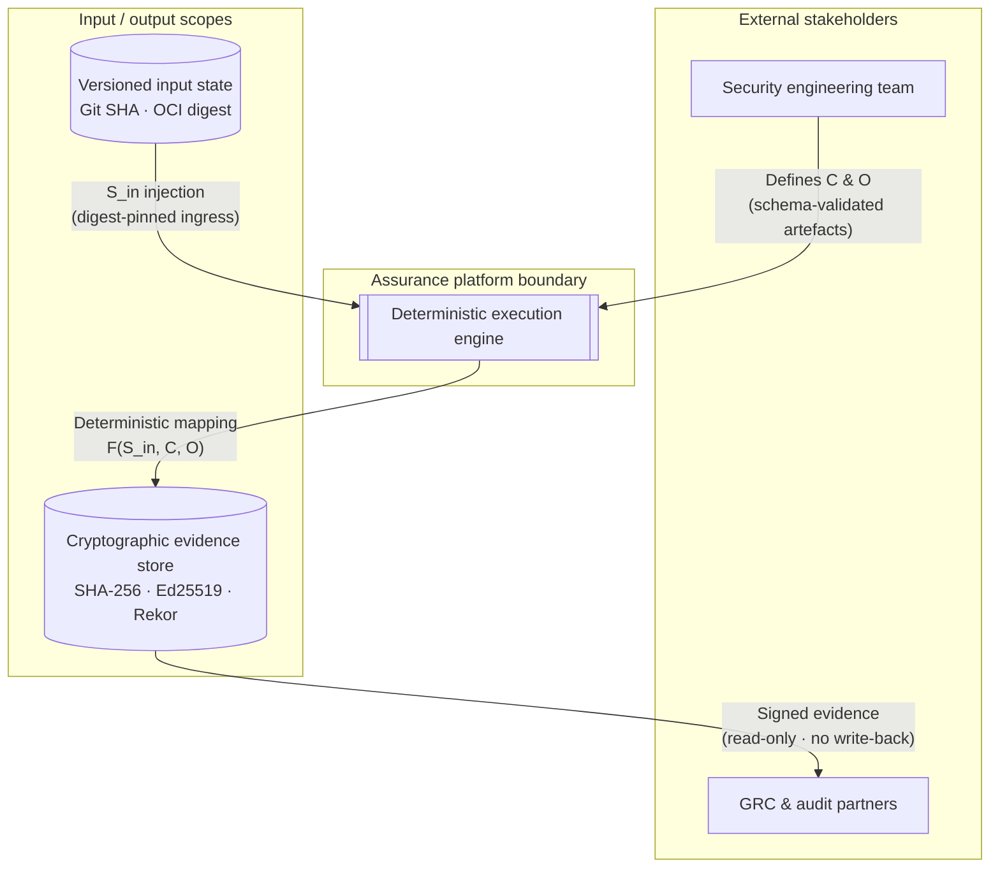
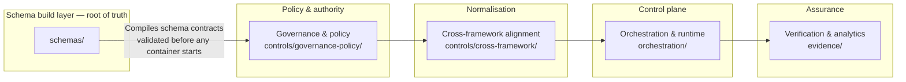
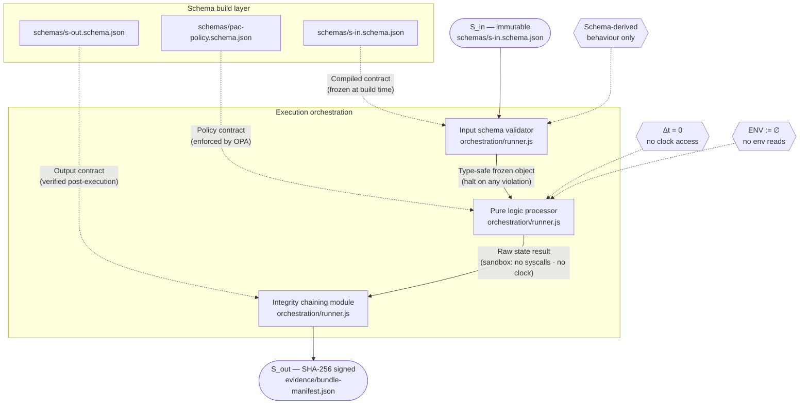

# IĀTŌ — Security Controls Index

<!--
Repository  : IĀTŌ
Path        : README.md
Purpose     : Canonical system index — control architecture, schema build layer,
              evidence model, agent prompt surface
Layer       : governance
Frameworks  : ISM 2025-04 · ISO/IEC 27001:2022 · Essential Eight ML3 · Privacy Act 1988 (Cth)
Invariant   : S_out := Verify(Sign_Ed25519(Hash_SHA256(F(S_in, C, O))))
Modified    : 2026-04-13
Schema-root : schemas/
-->

> Operational security assurance index for engineering, platform, and model execution workflows.
> ISM-aligned · ISO 27001:2022 · Essential Eight ML3 · Evidence-ledger backed · Audit-ready.

---

## 1. Design 

IĀTŌ exists to eliminate three categories of failure that are endemic to conventionally
operated assurance programmes.

**Runtime interpretation.** Systems that resolve policy at execution time introduce a
dependency between the runtime environment and the control outcome. Any variance in
interpreter version, library state, or ambient configuration produces a variance in the
assurance result. This is not a tolerable property in an audited system. IĀTŌ eliminates
runtime interpretation by deriving all executable behaviour from statically compiled,
schema-validated artefacts. The runtime does not define behaviour; it executes a
pre-validated specification.

**Temporal drift.** Systems that read wall-clock time as an input to control logic
introduce a non-reproducible variable. Two runs of the same logic at different times
can produce different outputs without any change to the inputs. This makes evidence
non-replayable and audit conclusions time-dependent. IĀTŌ eliminates temporal drift by
prohibiting all clock reads within the execution function. Time, where required by
control logic, is a versioned schema parameter — injected, declared, and traceable.

**Audit ambiguity.** Systems that rely on human attestation, narrative documentation,
or unstructured evidence introduce a gap between what the system claims and what can
be independently verified. IĀTŌ eliminates audit ambiguity by binding every
architectural claim to a concrete artefact with a declared schema, a cryptographic
digest, and a provenance chain traceable to a specific Git commit and signing identity.

The system is not designed to be convenient. It is designed to be correct, reproducible,
and independently verifiable by a party with no access to the authors, the infrastructure,
or the build environment.

---

## 2. Architectural Invariant

All system output is bound to the following function:

```
S_out := Verify(Sign_Ed25519(Hash_SHA256(F(S_in, C, O))))
```

| Symbol | Definition | Binding |
|:---|:---|:---|
| `S_in` | Versioned input state | Git SHA-pinned or OCI digest-pinned artefact |
| `C` | Control mapping | `schemas/` → `controls/` compilation output |
| `O` | Orchestration graph | `pipeline/pipeline.config.json` DAG declaration |
| `F` | Execution function | Pure, stateless, deterministic |
| `S_out` | Signed evidence record | `evidence/` append-only store |

Any variance in `S_out` without a corresponding change in the input tuple `(S_in, C, O)`
is a system failure. It is not a tolerance, an acceptable delta, or an edge case.
It is a falsification of the determinism claim and must be treated as a control breach.

`Verify` rejects any output whose hash does not match the signed digest. Verification
failure is terminal; no downstream consumer may proceed on an unverified output.

For all `x ∈ V` (the set of valid execution contexts), `F(x)` is a single-valued mapping.
Stochastic or environment-sensitive execution paths are constraint violations, not
implementation choices.

---

## 3. Schema Build Layer

The schema build layer is the root of all system guarantees. It is not a validation
step within the pipeline. It is the compilation stage from which all executable
behaviour is derived.

```
governance/          →  policy intent (human-authored, version-controlled)
    ↓
schemas/             →  machine-enforceable contract (JSON Schema draft-2020-12
    ↓                    / Protobuf 3 — compiled from governance layer)
controls/            →  control objects (derived from schema compilation,
    ↓                    not authored independently)
build/               →  container specifications (Containerfiles bound to
    ↓                    schema-validated inputs)
orchestration/       →  DAG execution graph (edges declared at initialisation,
    ↓                    validated against schema before first run)
runtime/             →  execution environment (schema-verified at initialisation,
    ↓                    blocked if version or ENV constraint violated)
evidence/            →  signed output artefacts (SHA-256 bound, Ed25519 signed,
                         append-only, auditor-operable without repository access)
```

**Schema primacy.** No executable artefact in `build/`, `orchestration/`, or `runtime/`
is valid unless it has been validated against a schema in `schemas/`. A schema
violation at any layer halts the system. There is no coercion, no default, and no
fallback to unvalidated state.

**Runtime behaviour is derived, not defined.** The runtime does not make policy
decisions. It executes the output of schema compilation. If the schema changes, the
runtime changes. If the schema does not change, the runtime cannot change. This
property makes the system auditable by schema inspection alone — the runtime is
a mechanical consequence of the schema layer.

**Governance → schema → build → execution → evidence** is a one-directional,
non-invertible flow. No stage writes back to a prior stage. Evidence does not modify
schema. Execution does not modify build artefacts. The DAG is acyclic at the
architectural level, not merely at the pipeline configuration level.

---

## 4. Execution Constraints

### 4.1 Temporal Decoupling (Δt = 0)

**Rationale.** Any logic that reads wall-clock time produces a result that is a
function of when it ran, not only of what it received. This makes the output
non-reproducible and the evidence non-replayable.

**Enforcement.** `datetime.now()`, `time.time()`, `Date.now()`, `$(date)`, hardware
clocks, and system entropy sources are prohibited in all execution paths. The
prohibition is enforced at the schema layer: any input schema that declares a
`timestamp` field as a runtime-read type is a schema violation.

**Artefact linkage.** Temporal parameters — log age windows, expiry thresholds,
pipeline run references — are declared as typed constants in
`pipeline/pipeline.config.json`, validated against `schemas/pipeline-config.schema.json`,
and injected as frozen schema-bound values. They are versioned inputs, not runtime reads.

---

### 4.2 Zero-Inference Runtime

**Rationale.** Dynamic dispatch, runtime reflection, and environment variable reads
introduce execution paths that are not derivable from schema inspection alone. They
create a gap between the declared system specification and the actual system behaviour.

**Enforcement.** `eval()`, `exec()`, `importlib.import_module()`,
`getattr(obj, dynamic_name)`, and all runtime reflection primitives are prohibited.
`ENV := ∅` — environment variables are cleared at container initialisation. No logic
path reads from `os.environ`, `process.env`, or equivalent. Configuration arrives
exclusively through schema-bound file-mounted inputs.

**Artefact linkage.** ENV cleanliness is verified at job initialisation by
`pipeline/verify-runtime.js` against the `blocked_env_vars` declaration in
`pipeline/runtime-versions.json`. The verification result is written to
`pipeline/outputs/runtime-verification.json` before any pipeline logic executes.

---

### 4.3 Immutable Ingestion

**Rationale.** A system that coerces or defaults invalid inputs cannot distinguish
between a correctly formed input and a malformed one. This makes the boundary between
valid and invalid system states undefined — the system cannot fail safely.

**Enforcement.** All inputs are validated against declared schemas (JSON Schema
draft-2020-12 or Protobuf 3) at the container boundary. Any field that is missing,
unrecognised, or type-mismatched halts execution immediately with a typed error.
No coercion. No defaults. No inference. The validated object is frozen before being
passed to any downstream component.

**Artefact linkage.** Every container boundary has a declared input schema in
`schemas/`. The schema is compiled into the container at build time and invoked by
`orchestration/runner.js` (`InputSchemaValidator` component) before any logic executes.
Mutation test results in `pipeline/outputs/mutations/mutation-report.json` prove that
the validator rejects invalid inputs — zero mutation escapes is the only acceptable result.

---

## 5. C4 Model

### Level 1 — System Context (Actor and Boundary Mapping)

The platform is a closed system during execution. No runtime network calls. No ambient
credential access. All ingress is version-controlled; all egress is immutable and signed.



**Artefact flow.**
- `A → C`: control mappings (`controls/`) and orchestration logic (`pipeline/pipeline.config.json`),
  delivered as Git SHA-pinned artefacts
- `D → C`: versioned input state, ingested through `schemas/s-in.schema.json`
- `C → E`: signed evidence records, written to `evidence/` (append-only)
- `E → B`: GRC partners consume via `evidence/verify-bundle.sh` — operable without
  repository access, requiring only `cosign`, `sha256sum`, and `jq`

---

### Level 2 — Container Decomposition (Schema Compilation Layer Explicit)



| Container | Directory | Responsibility | Deterministic constraint |
|:---|:---|:---|:---|
| Schema build layer | `schemas/` | Compiles all policy intent into machine-enforceable contracts | Root of truth — no artefact is valid without schema derivation |
| Governance & policy | `controls/governance-policy/` | Control taxonomy (ISM, E8 ML3, SOC 2 CC) | Static constant initialisation only |
| Cross-framework alignment | `controls/cross-framework/` | Normalises framework requirements into unified schema | Pure functional transformation; no I/O |
| Orchestration & runtime | `orchestration/` | Executes stubbed inputs through control logic via DAG | Strict DAG; all edges declared at initialisation |
| Verification & analytics | `evidence/` | Produces SHA-256 bound evidence and Ed25519 signatures | Output bounded to declared filesystem scope |

---

### Level 3 — Component Interaction (Schema-Enforced Execution Pipeline)



**InputSchemaValidator** (`orchestration/runner.js`). Validates `S_in` against
`schemas/s-in.schema.json`. Halt-on-violation. No coercion. No defaults. Emits a
frozen, immutable object. Proven by mutation suite: `pipeline/outputs/mutations/mutation-report.json`
must declare `escaped: 0`.

**PureLogicProcessor** (`orchestration/runner.js`). Executes the control mapping
against validated input state inside a hardened sandbox. Sandbox strips: system calls,
clock reads, network primitives, out-of-scope file I/O. Given the same frozen input,
output is byte-for-byte identical. Proven by determinism harness:
`pipeline/outputs/harness/determinism-result.json` must declare `status: DETERMINISM_PASS`.

**IntegrityChainModule** (`orchestration/runner.js`). Runs post-execution.
Calculates `SHA-256(output_state)`, chains to the prior execution block, signs
with Ed25519. Key material injected at initialisation — never from environment.
Output written to `evidence/` as an append-only record.

---

### Level 4 — Cryptographic Primitive (Invariant Binding)

All evidence produced by the platform is bound to:

```
S_out := Verify(Sign_Ed25519(Hash_SHA256(F(S_in, C, O))))
```

**Implementation.**

```
F(S_in, C, O)          →  PureLogicProcessor output (determinism-proven)
Hash_SHA256(·)         →  node:crypto createHash('sha256') — no subprocess, no clock
Sign_Ed25519(·)        →  Ed25519 key injected at initialisation + Cosign keyless OIDC
Verify(·)              →  slsa-verifier + cosign verify — terminal failure on mismatch
```

**SLSA Build Level 3 provenance.** The SLSA Generic Generator
(`slsa-framework/slsa-github-generator`) produces a DSSE-wrapped in-toto statement
linking every build artefact to a specific Git commit SHA, GitHub Actions workflow ref,
and OIDC signing identity. The provenance is published to the Sigstore Rekor transparency
log. The output schema is declared in `schemas/slsa-provenance.schema.json`.

**POSIX-compliant primitives only.** No middleware-induced variance. The cryptographic
chain is reproducible on any POSIX-compliant system with `sha256sum`, `cosign`, and
`slsa-verifier` installed.

---

## 6. Repository Index

### Directory Structure

```
IĀTŌ/
│
├── schemas/                        # Schema build layer — ROOT OF TRUTH
│   ├── s-in.schema.json            # S_in input state contract
│   ├── s-out.schema.json           # S_out evidence record contract
│   ├── pac-policy.schema.json      # JSON PaC policy object contract
│   ├── pac-evaluator-input.schema.json
│   ├── pac-evaluation-result.schema.json
│   ├── attestation.schema.json     # Cosign attestation record
│   ├── slsa-provenance.schema.json # SLSA in-toto statement structure
│   ├── slsa-provenance-decoded.schema.json
│   ├── mapping-matrix.schema.json  # Control coverage mapping contract
│   ├── bundle-manifest.schema.json # Evidence bundle manifest contract
│   ├── bundle-config.schema.json
│   ├── webhook-alert.schema.json   # Alert payload contract
│   ├── webhook-config.schema.json
│   ├── webhook-registration.schema.json
│   ├── webhook-endpoints-secret.schema.json
│   ├── canary-manifest.schema.json # Canary token placement contract
│   ├── canary-placement-log.schema.json
│   ├── tracebit-manifest.schema.json
│   ├── tracebit-reminder.schema.json
│   ├── tracebit-secrets-manifest.schema.json
│   ├── tracebit-deployment-log.schema.json
│   ├── tracebit-build-placements.schema.json
│   ├── canary-build-deployer-input.schema.json
│   ├── asset-surface-map.schema.json
│   ├── alert-channels.schema.json
│   ├── mutation-manifest.schema.json
│   ├── mutation-report.schema.json
│   ├── determinism-result.schema.json
│   ├── runbook.schema.json
│   ├── runtime-versions.schema.json
│   ├── runtime-verification.schema.json
│   ├── ingress-manifest.schema.json
│   ├── ingress-verification.schema.json
│   ├── failure-record.schema.json
│   ├── parity-baseline.schema.json
│   └── parity-verification.schema.json
│
├── controls/                       # Control objects — derived from schema layer
│   ├── governance-policy/
│   │   └── Containerfile           # ISM · E8 ML3 · SOC 2 taxonomy container
│   ├── cross-framework/
│   │   └── Containerfile           # Pure functional normalisation container
│   └── pac-policy.json             # JSON PaC object (OPA · Azure Policy · AWS IAM shapes)
│
├── build/                          # Container build specifications
│   ├── execution-orchestration/
│   │   └── Containerfile
│   ├── validation-analytics/
│   │   └── Containerfile
│   ├── sbom-generator/
│   │   └── Containerfile
│   └── determinism-harness/
│       └── Containerfile
│
├── orchestration/                  # DAG execution graph and subprocess management
│   ├── runner.js                   # InputSchemaValidator · PureLogicProcessor · IntegrityChainModule
│   ├── runner.schema.json          # Runner input contract
│   ├── harness.js                  # Determinism verification harness
│   ├── harness.schema.json
│   ├── mutation-runner.js          # Mutation testing suite
│   ├── sbom-runner.js              # Syft subprocess manager
│   ├── sbom-runner.schema.json
│   ├── webhook-dispatcher.js       # Fire-and-forget alert dispatcher
│   └── package.json                # Pinned dependencies — no shell-interpolated scripts
│
├── pipeline/                       # Pipeline configuration and execution modules
│   ├── pipeline.config.json        # Schema-bound pipeline constants (no clock reads)
│   ├── runtime-versions.json       # Declared tool versions + ENV blocklist
│   ├── mapping-matrix.json         # Control coverage — ISM · E8 · SOC 2 crosswalk
│   ├── pac-policy.json             # (symlink → controls/pac-policy.json)
│   ├── pac-evaluator-input.json
│   ├── webhook-config.json
│   ├── bundle-config.json
│   ├── canary-build-deployer-input.json
│   ├── parity-baseline.json        # Committed after verified CI pass
│   ├── verify-runtime.js           # Runner version + ENV verification
│   ├── verify-artefact-ingress.js  # Cross-job digest verification
│   ├── record-artefact-digests.js  # Digest manifest producer
│   ├── emit-failure.js             # Structured failure record emitter
│   ├── verify-parity.js            # Local/CI output parity verifier
│   ├── capture-parity-baseline.js  # Baseline digest capture (run post verified CI)
│   ├── package-evidence-bundle.js  # Evidence bundle assembler
│   ├── generate-coverage-table.js  # Markdown coverage table from mapping matrix
│   ├── generate-runbook.js         # DAG-derived operator runbook
│   ├── inject-webhook-endpoints.js
│   ├── register-webhooks.js
│   └── embed-canaries.js
│
├── policies/                       # Policy-as-Code enforcement layer
│   ├── podman-runtime.rego         # OPA policy — Podman runtime constraints
│   ├── podman-runtime.schema.json  # Input schema for Conftest evaluation
│   └── pac-evaluator.js            # OPA bridge — JSON PaC → Conftest
│
├── canary/                         # Thinkst Canary Token deployment layer
│   ├── asset-surface-map.json      # Flock definitions and risk tiers
│   ├── tracebit-placement-manifest.json  # Full token placement specification
│   ├── tracebit-build-placements.json    # Build-process token placements
│   ├── tracebit-deployer.js        # Thinkst API deployment bridge
│   ├── tracebit-build-deployer.js  # Build-artefact token deployer (post-signing)
│   ├── tracebit-rotator.js         # Token rotation and forensic archival
│   └── alert-channels.json        # Severity routing + fatigue guard
│
├── runtime/                        # Runtime consistency verification
│   └── (outputs written to pipeline/outputs/runtime-verification.json)
│
├── evidence/                       # Cryptographic evidence store — append-only
│   ├── bundle-manifest.json        # SHA-256 bound, Ed25519 signed, Cosign attested
│   ├── verify-bundle.sh            # Auditor-operable verification script
│   │                               # Requires: cosign · sha256sum · jq only
│   └── [run-specific outputs]      # Provenance · SBOM · coverage table · runbook
│
├── tests/                          # Verification harnesses and mutation fixtures
│   └── mutations/
│       ├── mutation-manifest.json
│       ├── MUT-001-missing-required.json
│       ├── MUT-002-wrong-type.json
│       ├── MUT-003-additional-property.json
│       ├── MUT-004-enum-violation.json
│       └── MUT-005-pattern-violation.json
│
├── .github/
│   ├── actions/
│   │   └── runtime-gate/
│   │       └── action.yml          # Composite action — version gate + ingress verify
│   └── workflows/
│       └── assurance-pipeline.yml  # Canonical pipeline — 18-stage DAG
│
└── Makefile                        # Local runner — mirrors CI DAG exactly
```

### Directory Responsibility Declarations

| Directory | Schema source | Responsibility | Write authority |
|:---|:---|:---|:---|
| `schemas/` | Self-defining | Compiles all policy intent into machine-enforceable contracts | Human authors only · version-controlled |
| `controls/` | `schemas/pac-policy.schema.json` | Control objects derived from schema compilation | Schema layer · CI pipeline |
| `build/` | `schemas/` (per-container) | Container specifications — OCI digest-pinned, rootless | CI pipeline only |
| `orchestration/` | `schemas/runner.schema.json` | DAG execution modules — pure functional, no I/O | Human authors only |
| `pipeline/` | `schemas/pipeline-config.schema.json` | Pipeline constants and execution modules | Human authors only |
| `policies/` | `schemas/pac-policy.schema.json` | OPA/Conftest policy enforcement layer | Human authors only |
| `canary/` | `schemas/tracebit-manifest.schema.json` | Token placement — post-signing, flock-organised | CI pipeline only |
| `evidence/` | `schemas/bundle-manifest.schema.json` | Signed output artefacts — append-only | CI pipeline only · no human writes |
| `tests/` | `schemas/mutation-manifest.schema.json` | Mutation fixtures and verification harnesses | Human authors only |

---

## 7. Versioning Model

### Version as System State

A version change is a system state mutation. It is not a label or a tag. Every version
increment must be traceable to a schema change, a control mapping change, or a
cryptographic primitive update. Version constants are declared as typed, immutable
values in `pipeline/pipeline.config.json` and validated against
`schemas/pipeline-config.schema.json` before any pipeline stage executes.

### Version Declaration Rules

```json
{
  "platform_version":      "string — semver, pattern ^\\d+\\.\\d+\\.\\d+$",
  "framework_version":     "string — ISM-YYYY-MM / E8-ML3-YYYY / SOC2-YYYY",
  "schema_root_version":   "string — semver, must increment on any schema change",
  "slsa_generator_version":"string — semver tag, must match reusable workflow ref",
  "slsa_verifier_version": "string — semver, pinned binary",
  "cosign_version":        "string — semver, pinned binary"
}
```

All version fields are `const`-equivalent: declared once, never mutated at runtime.
A pipeline run that encounters a version field absent from `pipeline.config.json` halts
with a `SCHEMA_VALIDATION_FAILURE` record.

### Enforcement Rules

| Event | Required action | Evidence artefact |
|:---|:---|:---|
| Any schema file changes | `schema_root_version` must increment | `pipeline/outputs/runtime-verification.json` |
| Any control mapping changes | `framework_version` must update | `pipeline/mapping-matrix.json` |
| Any tool version changes | `pipeline/runtime-versions.json` must update | `pipeline/outputs/runtime-verification.json` |
| Any container image changes | Containerfile digest must update | `pipeline/outputs/sbom-cyclonedx.json` |
| Any pipeline config changes | Git commit SHA must change | `evidence/bundle-manifest.json` |

### Commit Integrity

Every commit that changes a file in `schemas/`, `controls/`, or `pipeline/pipeline.config.json`
must produce a corresponding update to `pipeline/mapping-matrix.json` that maps the changed
artefact to its ISM control references. A commit that changes a schema without updating the
mapping matrix is an incomplete state mutation and must not pass the `evaluate-policies` gate.

---

## 8. Evidence Model

### Required Fields

Every artefact in `evidence/` must be traceable through the following chain:

```
artefact_path          →  string (canonical path within evidence/)
sha256_digest          →  string (pattern ^sha256:[0-9a-f]{64}$)
ed25519_signature      →  string (base64url-encoded)
cosign_rekor_log_index →  integer (Sigstore Rekor transparency log entry)
slsa_provenance_ref    →  string (path to assurance-platform.intoto.jsonl)
pipeline_run_ref       →  string (Git commit SHA — not a clock read)
producing_stage        →  string (pipeline stage that wrote this artefact)
framework_controls     →  array of string (ISM · E8 · SOC 2 control IDs)
```

All fields are required. No additionalProperties. Declared in
`schemas/bundle-manifest.schema.json`.

### Replayability

Any evidence artefact in `evidence/` must be independently replayable by a party with:

- The artefact file
- The `evidence/verify-bundle.sh` script
- `cosign`, `sha256sum`, and `jq` installed
- No access to the repository, the build environment, or the authors

`verify-bundle.sh` reads all verification parameters from `evidence/bundle-manifest.json`
using `jq`. It contains no hardcoded values and no environment variable reads except `PATH`.
It exits 0 on full verification, 1 on any digest mismatch or signature failure.

### Audit Independence

The evidence store is designed for a party that:

1. Does not trust the authors
2. Does not have access to the build infrastructure
3. Cannot re-run the pipeline
4. Must be able to confirm or refute every architectural claim from the artefacts alone

This is not a secondary goal. It is the primary design constraint of the evidence model.
An evidence bundle that requires author explanation to interpret is an incomplete evidence
bundle.

---

## 9. Codex / Agent Prompt Surface

This section defines the rules for any machine agent operating on this repository.
Non-compliance with these rules constitutes a generation failure regardless of the
quality of other output.

### Fundamental Operating Rules

**Rule 1 — Path-based reasoning only.** Every claim about system state must reference
a specific file path, schema field, or pipeline stage. Assertions not grounded in a
declared artefact are prohibited. There is no implicit knowledge about this system.

**Rule 2 — Schema before implementation.** Before generating any file, the agent must
identify the schema that governs it. If no schema exists, the agent must generate the
schema first and validate the implementation against it. Implementation without schema
is a constraint violation.

**Rule 3 — No inference.** The agent must not infer the content of undeclared files,
the behaviour of undeclared stages, or the meaning of undeclared fields. If a required
artefact is absent, the agent must declare it absent and halt — not fill the gap with
a plausible value.

**Rule 4 — Constraint inheritance.** Every generated file inherits all constraints from
all prior iterations of this prompt series. Constraints are additive and non-revocable.
A later prompt cannot remove a constraint imposed by an earlier prompt.

**Rule 5 — Fail-fast, structured.** Every failure path must emit a structured record
conforming to `schemas/failure-record.schema.json` before exiting non-zero. A raw
`exit 1` without a structured record is a generation failure.

**Rule 6 — No clock reads.** No generated file may call `Date.now()`, `datetime.now()`,
`time.time()`, or equivalent within any logic path. The one documented exception
(`emit-failure.js` fallback filename) is a named trade-off, not a template.

**Rule 7 — ENV := ∅.** No generated file may read from `process.env`, `os.environ`,
or equivalent within any logic path. Configuration arrives via schema-bound file mounts
declared in `pipeline/pipeline.config.json`.

**Rule 8 — DAG topology.** All pipeline stages must form a strictly directed acyclic
graph. Every stage must declare its upstream dependency. No stage may write to the
input scope of a prior stage. Back-edges are constraint violations.

### Step-by-Step Agent Reasoning Workflow

When given a task involving this repository, execute the following steps in order.
Do not skip steps. Do not reorder steps.

```
Step 1 — Identify the target file or stage.
          What is the canonical path of the artefact to be generated or modified?

Step 2 — Identify the governing schema.
          What schema in schemas/ governs this artefact?
          If none exists: generate the schema first (go to Step 2a).
          Step 2a — Generate schema. Validate it is consistent with all adjacent schemas.
                    Confirm it introduces no additionalProperties violations.

Step 3 — Identify upstream dependencies.
          What stage or artefact must exist before this file can be generated?
          Are those artefacts present? If not: halt and declare what is absent.

Step 4 — Identify downstream consumers.
          What stage or artefact receives the output of this file?
          Does the output schema match the consumer's input schema?

Step 5 — Identify constraint surface.
          Which of the following constraints apply to this file?
          [ ] Δt = 0  [ ] ENV := ∅  [ ] No eval/exec  [ ] DAG  [ ] Fail-fast
          [ ] Schema-validated ingress  [ ] Structured failure record on exit 1

Step 6 — Identify ISM control mapping.
          Which ISM, E8, or SOC 2 controls does this file satisfy?
          Does pipeline/mapping-matrix.json need updating?

Step 7 — Generate the file.
          Apply all constraints identified in Steps 1–6.
          Every claim must be traceable to a schema field or pipeline stage.

Step 8 — Generate the comment block.
          Every file must be prefaced with:
          # File: <canonical path>
          # Role: <one sentence>
          # Constraints enforced: <comma-separated>
          # Upstream: <stage or ROOT>
          # Downstream: <stage or TERMINAL>
          # ISM controls: <comma-separated>

Step 9 — Declare trade-offs.
          If any constraint was relaxed: emit a # CONSTRAINT TRADE-OFF block
          naming the constraint, the rationale, and the boundary condition.

Step 10 — Update mapping matrix.
           Emit a diff to pipeline/mapping-matrix.json declaring the new or updated
           control coverage entry. coverage_status must be COVERED or
           COVERAGE_STRUCTURAL_ONLY with a gap_note. Never omit this step.
```

### Prohibited Agent Behaviours

| Behaviour | Reason |
|:---|:---|
| Generating a file without a governing schema | Schema primacy violation |
| Inferring a field value not declared in schema | Zero-inference violation |
| Using `shell: true` in any subprocess call | ENV := ∅ violation |
| Using `eval()`, `exec()`, or dynamic `import()` | Zero-inference violation |
| Reading from `process.env` in logic paths | ENV := ∅ violation |
| Emitting `exit 1` without a structured failure record | Fail-fast protocol violation |
| Creating a back-edge in the pipeline DAG | DAG topology violation |
| Referencing a file that is not in the repository index | Path-based reasoning violation |
| Promoting `COVERAGE_STRUCTURAL_ONLY` to `COVERED` without live evaluation | Audit integrity violation |
| Suppressing a `# CONSTRAINT TRADE-OFF` | Transparency violation |

---

## 10. OpSec Boundary

All client-facing documentation — this README, the evidence bundle, the operator runbook,
and the generated coverage table — communicates through the normative container and component
labels defined in Sections 5 and 6. Internal file paths below the `controls/` and `build/`
directory boundaries, infrastructure hostnames, cloud account identifiers, and signing key
identifiers are not exposed in any client-facing artefact.


The IĀTŌ evidence chain is verifiable without infrastructure disclosure because:

1. The SLSA provenance document links the build artefact to a Git commit SHA and a
   GitHub Actions workflow ref — both public, neither infrastructure-revealing
2. The Cosign keyless attestation links the signing identity to a GitHub OIDC token —
   The identity is the workflow ref, not a private key or an account identifier
3. The `evidence/verify-bundle.sh` script requires only the bundle itself — no
   repository clone, no cloud credentials, no author contact
4. The Sigstore Rekor transparency log provides independent, tamper-evident timestamping —
   The log entry is verifiable by any party without access to the platform

**Disclosed:** that a specific Git commit produced a specific artefact with a
specific digest, signed by a specific GitHub Actions workflow identity, at a Rekor log
index that is publicly auditable.

>**Non-Disclosed:** the internal directory structure of the build environment,
the cloud accounts hosting the infrastructure, the names of individuals who authored
the controls, or the network topology of the execution environment.

----

***The deception layer (Thinkst Canary Tokens) adds a detection boundary that is not
disclosed in client-facing documentation. The existence of the detection layer is
referenced only through its ISM control mappings (`CTRL-TRACE-01` through `CTRL-TRACE-04`)
in `pipeline/mapping-matrix.json`. Token placement specifics, flock identifiers, and
console domain are held within the operational boundary and are not disclosed.***


<!--
END OF SYSTEM INDEX
All sections above are normative. No section is illustrative.
Every claim maps to: schema → build → execution → evidence.
No claim exists without enforcement linkage.
-->
