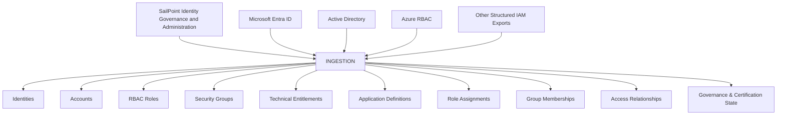
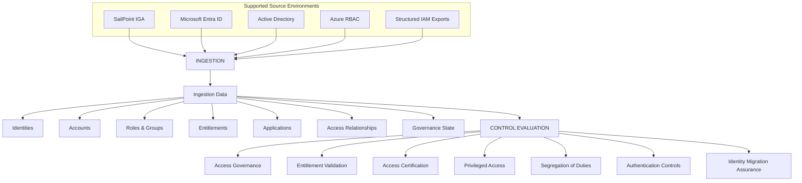

# v1.0.0: IAM Control Evaluation Framework


## Overview

Ingests → Normalises → Evaluates


CEF `v1.0.0` separates source system data from control evaluation logic. Identity and access information from platforms such as SailPoint IGA, Microsoft Entra ID, and Active Directory is transformed into a common representation before being evaluated against access governance, entitlement, privileged access, Segregation of Duties (SoD), authentication, and migration assurance controls.

The resulting evaluations are converted into structured evidence containing the control assertion, evaluated identity state, outcome, timestamp, and supporting traceability information.

The operating model is:

```text
+-----------------------+      +-----------------------+      +-----------------------+      +-----------------------+
|     1. INGESTION      |      |     2. MODELLING      |      |     3. EVALUATION     |      |      4. EVIDENCE      |
|   SailPoint / Entra   |----->|   Normalised Graph    |----->|    RBAC Assertions    |----->|   Audit Attestation   |
|   ID / Active Dir.    |      |         Model         |      |        & SoD          |      |         Log           |
+-----------------------+      +-----------------------+      +-----------------------+      +-----------------------+
            |                              |                              |                              |
            |                              |                              |                              |
            v                              v                              v                              v
    [ Ingested Data ]              [ Normalised Model ]           [ Evaluated Controls ]          [ Audit Evidence ]
    - Identities & Accounts        - Identity relationships       - Segregation of Duties        - Control result
    - RBAC Roles & Groups          - RBAC relationships            - Privileged Access             - Finding
    - Technical Entitlements      - Entitlement relationships    - Migration Drift               - Source reference
                                   - Access relationships                                         - Traceability
````

The framework is designed around the principle that IAM assurance should be derived from the observed identity and access state rather than from static documentation alone.

## Executive Summary

The framework establishes a repeatable pipeline for identity and access assurance.

Source system extracts are collected from authoritative identity platforms, transformed into a normalised identity and access model, evaluated against explicit control assertions, and recorded as structured evidence.

The architecture separates four concerns:

| **Ingestion**                                                               | **Modelling**                                                                                  | **Evaluation**                                                                                    | **Evidence**                                                                                                  |
| --------------------------------------------------------------------------- | ---------------------------------------------------------------------------------------------- | ------------------------------------------------------------------------------------------------- | ------------------------------------------------------------------------------------------------------------- |
| Collection of identity, account, role, group, entitlement, and access data. | Transformation of source-specific structures into a common identity and access representation. | Execution of RBAC, SoD, privileged-access, authentication, entitlement, and migration assertions. | Generation of traceable evaluation records containing the evaluated state, assertion, outcome, and timestamp. |

The implementation is (read-only). Source identity, access, entitlement, role, group, and policy resources are not modified by the assurance process.

## Operating Workflow

### 1. Multi-Source Ingestion

The ingestion stage extracts identity and access topology from authoritative sources.





The ingestion stage is concerned with capturing the observed state. It does not perform control evaluation.

### 2. Identity and Access Modelling

Source extracts are transformed into a common representation so that downstream control logic does not need to understand every vendor-specific schema.

The model represents relationships between:

```yaml
identity:
  account:
    application:
      role:
        entitlement:
```

Additional governance relationships can represent:

```yaml
identity:
  reviewer:
    certification:
      decision:
```

This allows the evaluation engine to reason about access relationships consistently across different identity platforms.

### 3. Control Assertion Execution

The evaluation stage executes defined IAM assertions against the normalised identity and access state.

Core evaluation areas include:



Example assertions include:

```yaml
control:
  control_id: IATO-AC-001
  domain: access_control
  assertion: active_access_must_have_an_attributable_identity_relationship
```

And:

```yaml
control:
  control_id: IATO-SD-001
  domain: segregation_of_duties
  assertion: conflicting_entitlements_must_not_be_assigned
```

Each assertion produces an explicit evaluation result rather than modifying the underlying identity state.

### 4. Evidence Capture

Each control evaluation produces a structured evidence record.

```yaml
evidence:
  control_id: IATO-SD-001
  identity_state:
    identity: recorded
    account: recorded
    entitlement_relationships: recorded
  assertion:
    definition: recorded
  evaluation:
    result: fail
    timestamp: recorded
  integrity:
    algorithm: SHA-256
    digest: recorded
```

Evidence is intended to maintain traceability between:

```text
Source State
    |
    v
Identity / Access Relationship
    |
    v
Control Assertion
    |
    v
Evaluation Result
    |
    v
Evidence Record
```

The evidence record does not itself constitute an access decision or remediation action.

## IAM Control Domains

The framework evaluates identity and access state across several IAM governance domains.

| Domain                 | Purpose                                                       |
| ---------------------- | ------------------------------------------------------------- |
| Access Control         | Validate authorised identity-to-resource access               |
| Authentication         | Evaluate authentication-related control state                 |
| Entitlement Management | Validate entitlement attribution and governance               |
| Identity Governance    | Evaluate identity and access governance relationships         |
| Privileged Access      | Evaluate privileged identities, accounts, and assignments     |
| Segregation of Duties  | Identify conflicting access combinations                      |
| Identity Migration     | Detect access and identity-state differences during migration |

## Segregation of Duties

SoD analysis evaluates identity entitlement relationships against defined incompatible access combinations.

```yaml
sod_control:
  control_id: IATO-SD-001
  domain: segregation_of_duties
  assertion: conflicting_entitlements_must_not_be_assigned

  evaluation:
    identity: user
    entitlement_a: entitlement_a
    entitlement_b: entitlement_b
    result: fail

  evidence:
    conflict_definition: defined
    entitlement_relationship: detected
    evaluation_timestamp: recorded
```

The purpose is to identify potentially conflicting access combinations for governance review and remediation through established IAM processes.

## Entitlement Governance

Entitlement governance evaluates whether access relationships remain attributable, appropriate, and reviewable.

```yaml
entitlement_control:
  control_id: IATO-EN-001
  domain: entitlement_management
  assertion: entitlement_relationship_must_be_attributable

  evidence:
    identity: recorded
    entitlement: recorded
    application: recorded
    relationship: recorded
    governance_state: recorded
```

This provides a structured basis for entitlement validation and access-governance activities.

## Access Certification

Access certification is represented as a governance relationship between an identity, the associated access, and an authorised review decision.

```yaml
access_certification:
  identity: user
  application: application
  entitlement: entitlement

  reviewer: authorised_reviewer

  decision:
    state: approved

  review:
    status: completed
    timestamp: recorded
```

Certification evidence can be associated with the underlying identity and entitlement state to support governance and audit activities.

## Privileged Access

Privileged access is evaluated as a distinct IAM governance concern.

```yaml
privileged_access:
  identity: user
  account: privileged_account
  privilege: privileged_role

  governance:
    attributable: true
    approved: true
    reviewed: true
```

The framework focuses on identity and access governance aspects of privileged access rather than implementing a separate privileged-access management platform.

## Microsoft Entra ID and Active Directory

The framework supports hybrid identity environments incorporating Microsoft Entra ID and Active Directory.

```yaml
identity_platform:

  cloud:
    platform: microsoft_entra_id
    controls:
      - conditional_access
      - role_assignments
      - group_membership
      - authentication

  directory:
    platform: active_directory
    controls:
      - accounts
      - groups
      - group_membership
      - privileged_access
```

The evaluation model focuses on resulting identity and access relationships rather than treating either platform as an isolated security domain.

## Azure RBAC

Azure RBAC relationships can form part of the access state evaluated during identity governance and migration assurance.

```yaml
azure_rbac:
  principal: user
  scope: subscription_or_resource
  role: assigned_role
  assignment_state: active
  governance_state: approved
```

Azure RBAC assignments can be evaluated alongside other identity, role, group, and entitlement relationships.

## Identity Migration Assurance

The framework can be applied to identity and access migration scenarios involving legacy IAM environments and Microsoft Entra ID or Azure RBAC target states.

```yaml
migration_assurance:

  source:
    platform: legacy_iam
    identity_state: captured
    access_state: captured

  target:
    platform: microsoft_entra_id
    access_state: captured
    rbac_state: captured

  comparison:
    identities: evaluated
    entitlements: evaluated
    roles: evaluated
    access_relationships: evaluated
    sod_relationships: evaluated

  outcome:
    migration_state: evaluated
    evidence: generated
```

Migration assurance can identify conditions such as:

* Missing identities
* Orphaned accounts
* Missing entitlements
* Unexpected role assignments
* Access relationship changes
* Privilege changes
* SoD differences
* Legacy access remaining after migration

The framework does not perform the migration itself.

## Policy-as-Code

IAM control assertions can be expressed as policy-as-code and evaluated against structured identity and access data.

```yaml
control:
  control_id: IATO-AC-001
  domain: access_control
  title: Authorised Access
  assertion: active_access_must_have_an_attributable_identity_relationship

  evaluation:
    expected_state: compliant
    failure_state: non_compliant
```

OPA/Rego provides the policy evaluation mechanism where policy-as-code execution is used.

The policy layer remains independent from external framework numbering.

## Control Identification

IAM controls use internal identifiers for implementation and evidence purposes.

```yaml
control_id:
  namespace: IATO
  domain: IAM
  sequence: 001
```

Current domain identifiers include:

```text
IATO-AC
IATO-AU
IATO-EN
IATO-GV
IATO-PA
IATO-SD
IATO-IM
```

| Identifier | Domain                 |
| ---------- | ---------------------- |
| `AC`       | Access Control         |
| `AU`       | Authentication         |
| `EN`       | Entitlement Management |
| `GV`       | Identity Governance    |
| `PA`       | Privileged Access      |
| `SD`       | Segregation of Duties  |
| `IM`       | Identity Migration     |

## Framework Alignment

The framework uses existing security frameworks as contextual references for applicable IAM controls.

### NZISM

Relevant areas include:

* Identity management
* Authentication
* Access control
* Privileged access
* Identity assurance
* Access governance

### ISM

Relevant areas include:

* Identity and access management
* Authentication
* Privileged access
* Access control
* Identity assurance

### Essential Eight

Where applicable, IAM-related controls include:

* Restrict Administrative Privileges
* Multi-Factor Authentication
* User Application Hardening

Framework mappings are maintained separately from IAM control implementation.

```yaml
framework_mapping:
  control_id: IATO-PA-001
  domain: privileged_access

  references:
    - framework: NZISM
      applicability: identity_and_access_control

    - framework: ISM
      applicability: identity_and_access_control

    - framework: E8
      control: restrict_administrative_privileges
```

Framework references do not create new compliance obligations and do not replace formal control interpretation or assessment.

## Read-Only Operation

The framework is designed for observation and assurance.

```yaml
operation:

  source_environment:
    read: permitted
    create: prohibited
    update: prohibited
    delete: prohibited

  output:
    analysis: permitted
    evidence_generation: permitted
    remediation: out_of_scope
```

Remediation remains within established IAM operational processes and change-management controls.

## Identity Governance and Administration

The framework is aligned with established IGA concepts rather than treating identity data as a generic configuration dataset.

Relevant activities include:

* Identity lifecycle governance
* Account and entitlement management
* Role and access governance
* Access certification
* Entitlement validation
* Privileged access review
* Segregation-of-Duties analysis
* Application access governance
* Identity migration assurance

SailPoint IGA is treated as an enterprise IGA platform within the broader IAM operating environment.

The framework does not attempt to replace SailPoint or reproduce proprietary SailPoint functionality.

## Repository Structure

```text
iato-root/
├── .github/
│   └── workflows/
│       ├── validate.yml
│       └── ledger-commit.yml
│
├── docs/
│   ├── IAM_CONTROL_CROSSWALK.csv
│   └── IDENTITY_DATA_MODEL.md
│
├── collectors/
│   ├── azure/
│   │   └── entra_snapshot.py
│   └── active_directory/
│       └── ad_snapshot.py
│
├── policies/
│   ├── access/
│   ├── authentication/
│   ├── entitlement/
│   ├── governance/
│   ├── privileged/
│   └── sod/
│
├── test/
│   ├── mutations/
│   └── unit/
│
├── evidence/
│   ├── generate_evidence.py
│   └── schemas/
│
├── ledger/
│   ├── scripts/
│   │   ├── hash_result.py
│   │   └── append_ledger.py
│   └── storage/
│       └── README.md
│
└── requirements.txt
```

## Scope

| Dimension            | Scope                                                |
| -------------------- | ---------------------------------------------------- |
| Practice             | Identity Engineering                                 |
| Job Family           | Identity and Access Management                       |
| Specialisation       | Identity Governance and Administration               |
| Primary IGA Platform | SailPoint IGA                                        |
| Cloud Identity       | Microsoft Entra ID                                   |
| Directory            | Active Directory                                     |
| Authorisation        | Azure RBAC                                           |
| Governance           | Access certification, entitlement management and SoD |
| Assurance            | IAM control validation and evidence                  |
| Migration            | Identity and access migration assurance              |
| Operation            | Read-only                                            |
| Remediation          | Out of scope                                         |

## Summary

CEF `v1.0.0` demonstrates how enterprise identity and access relationships can be represented as structured data, evaluated against explicit IAM control assertions, and converted into machine-verifiable evidence.

The framework is centred on:

```yaml
practice:
  identity_engineering:
    domain: identity_and_access_management
    specialisation: identity_governance_and_administration

capabilities:
  - identity_governance
  - entitlement_management
  - access_certification
  - segregation_of_duties
  - privileged_access_governance
  - authentication
  - access_control
  - identity_migration_assurance

platforms:
  - sailpoint_iga
  - microsoft_entra_id
  - active_directory
  - azure_rbac

assurance:
  - iam_control_validation
  - migration_assurance
  - auditable_identity_evidence
```

The project demonstrates practical application of IAM governance and assurance concepts across hybrid enterprise identity environments, with particular emphasis on identity state, entitlement relationships, access governance, SoD analysis, privileged access, and migration assurance.


