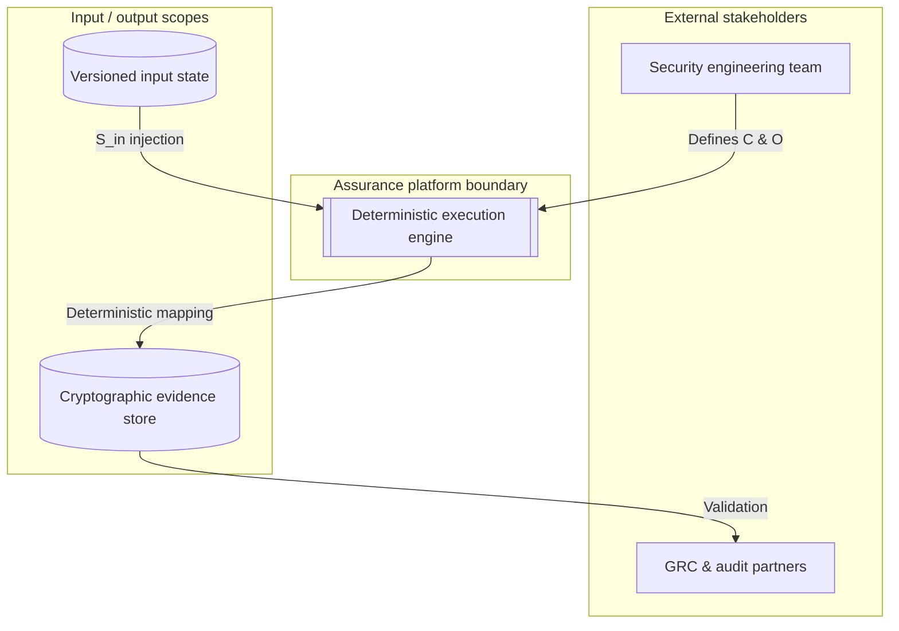
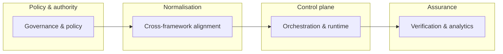
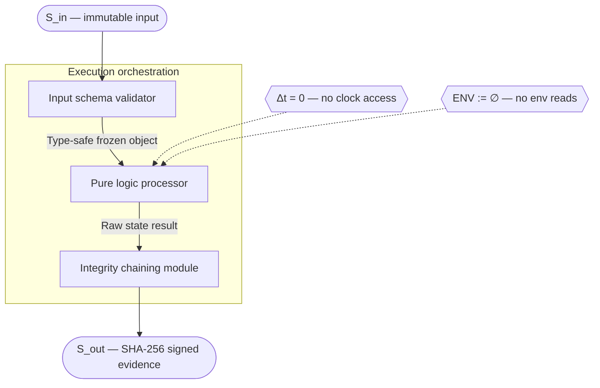

# IĀTŌ — Security Controls Index

<!--
Repository : IĀTŌ
Path       : README.md
Purpose    : Canonical entry document — control index, assurance programme, evidence model
Layer      : governance
Frameworks : ISM · ISO/IEC 27001:2022 · Essential Eight ML3 · Privacy Act 1988 (Cth)
Modified   : 2026-04-13
-->

> Operational security assurance index for engineering, platform, and model execution workflows.  
> ISM-aligned · ISO 27001:2022 · Essential Eight ML4 · Evidence-ledger backed · Audit-ready.

---
## Architecture

The platform is built on a **zero-variance execution model**. Every run is a pure function of
its inputs: given identical versioned artefacts, control mappings, and orchestration logic, the
output is bit-for-bit identical. This property is architectural, not aspirational — it is
enforced at the compiler and runtime levels through the constraints described below.

```
S_out := Verify(Sign_Ed25519(Hash_SHA256(F(S_in, C, O))))
```

`S_in` is the versioned input state. `C` is the control mapping. `O` is the orchestration
graph. Any variance in `S_out` without a corresponding change in the input tuple is treated as
a system failure, not a tolerance.

---

### Execution constraints

Three constraints are enforced unconditionally across all containers.

**Temporal decoupling (Δt = 0).** No logic reads from hardware clocks, system entropy, or
timestamp APIs. Any temporal value required by the logic — log age windows, expiry thresholds
— must be injected as a versioned, stubbed input field. Time is a parameter, not a runtime
primitive.

**Zero-inference runtime.** `eval()`, `exec()`, and all dynamic reflection primitives are
prohibited. Environment variables are cleared at initialisation (`ENV := ∅`). Configuration
arrives exclusively through schema-bound input.

**Immutable ingestion.** All inputs are validated against strict schemas (JSON Schema
draft-2020-12 or Protobuf 3) at the container boundary. A missing field, unrecognised key,
or type mismatch halts execution immediately. The validated object is frozen before it is
passed downstream. No coercion. No defaults. No inference.

---

### System context (C4 Level 1)

The platform interacts with two external actor classes. During execution, it is a closed
system: no runtime network calls, no ambient credential access.



The **security engineering team** defines control mappings and orchestration logic, delivered
as version-controlled artefacts (Git SHA-pinned or OCI digest-pinned). The **GRC and audit
partners** consume the cryptographically signed evidence records and crosswalk trace matrices
emitted by the platform. Their access is read-only; there is no write-back path to the
platform from the audit boundary.

---

### Container decomposition (C4 Level 2)

The system is decomposed into four deployable containers. Communication between containers is
strictly linear and unidirectional. No container calls back to a prior stage.



| Container | Responsibility | Deterministic constraint |
|:---|:---|:---|
| Governance & policy | Defines control taxonomy (ISM, E8 ML3, SOC 2 CC) | Static constant initialisation only |
| Cross-framework alignment | Normalises framework requirements into unified schema | Pure functional transformation; no I/O |
| Orchestration & runtime | Executes stubbed inputs through control logic via DAG | Strict DAG; all edges declared at initialisation |
| Verification & analytics | Produces SHA-256 bound evidence and Ed25519 signatures | Output bounded to declared filesystem scope |

Each container is independently startable, stateless between invocations, and produces
identical output given identical inputs.

---

### Component interaction (C4 Level 3)

This view details the internal logic of the **orchestration & runtime** container. The three
components enforce a strict data-before-logic boundary: no component receives data that has
not been validated and frozen by the component upstream of it.



**Input schema validator** validates `S_in` against the declared schema. Any missing field,
unrecognised key, or type mismatch raises a typed error and halts execution. The validator
emits a frozen, immutable object; no downstream component can mutate it.

**Pure logic processor** executes the control mapping against the validated input state inside
a hardened sandbox. The sandbox strips system calls, clock reads, network primitives, and
out-of-scope file I/O. Given the same frozen input, the processor is guaranteed to produce
byte-for-byte identical output.

**Integrity chaining module** runs post-execution. It calculates `SHA-256(output_state)`,
chains that hash to the previous execution block to maintain verifiable provenance, then signs
the record with Ed25519. Key material is injected at initialisation and is never read from the
environment.

---

### Cryptographic primitive (C4 Level 4)

All evidence produced by the platform is bound to the following invariant:

```
S_out := Verify(Sign_Ed25519(Hash_SHA256(F(S_in, C, O))))
```

`Verify` rejects any output whose hash does not match the signed digest — verification failure
is terminal. For all `x` in the set of valid execution contexts, `F(x)` is a single-valued
mapping. The platform eliminates execution divergence by construction, not by convention.

> **OpSec note.** This documentation communicates through the normative container and component
> labels defined above. Internal file paths, infrastructure hostnames, and implementation-
> specific naming conventions are not exposed in client-facing artefacts. The Intent-to-
> Auditable-Trust-Object (IĀTŌ) remains verifiable through the cryptographic evidence chain
> without disclosing the underlying physical infrastructure.
