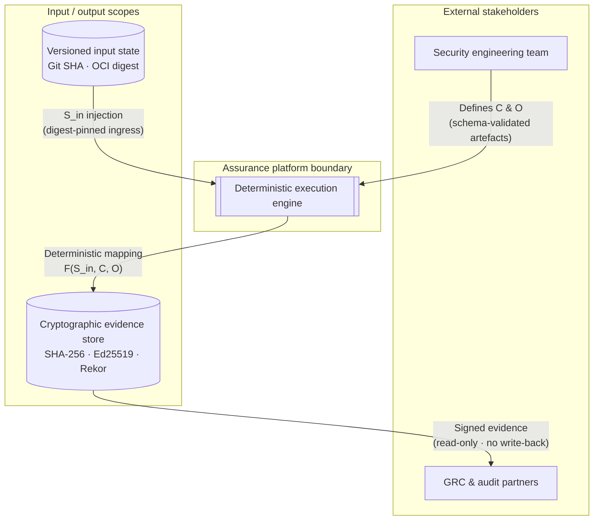
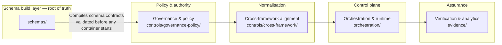

# IĀTŌ — Security Controls Index

<!--
Repository  : IĀTŌ
Path        : README.md
Purpose     : Canonical system index — control architecture, schema build layer,
              evidence model, agent prompt surface
Layer       : governance
Frameworks  : ISM 2025-04 · ISO/IEC 27001:2022 · Essential Eight ML3 · Privacy Act 1988 (Cth)
Invariant   : S_out := Verify(Sign_Ed25519(Hash_SHA256(F(S_in, C, O))))
Modified    : 2026-04-13
Schema-root : schemas/
-->

> Operational security assurance index for engineering, platform, and model execution workflows.
> ISM-aligned · ISO 27001:2022 · Essential Eight ML3 · Evidence-ledger backed · Audit-ready.

---

## 1. Design 

IĀTŌ exists to eliminate three categories of failure that are endemic to conventionally
operated assurance programmes.

**Runtime interpretation.** Systems that resolve policy at execution time introduce a
dependency between the runtime environment and the control outcome. Any variance in
interpreter version, library state, or ambient configuration produces a variance in the
assurance result. This is not a tolerable property in an audited system. IĀTŌ eliminates
runtime interpretation by deriving all executable behaviour from statically compiled,
schema-validated artefacts. The runtime does not define behaviour; it executes a
pre-validated specification.

**Temporal drift.** Systems that read wall-clock time as an input to control logic
introduce a non-reproducible variable. Two runs of the same logic at different times
can produce different outputs without any change to the inputs. This makes evidence
non-replayable and audit conclusions time-dependent. IĀTŌ eliminates temporal drift by
prohibiting all clock reads within the execution function. Time, where required by
control logic, is a versioned schema parameter — injected, declared, and traceable.

**Audit ambiguity.** Systems that rely on human attestation, narrative documentation,
or unstructured evidence introduce a gap between what the system claims and what can
be independently verified. IĀTŌ eliminates audit ambiguity by binding every
architectural claim to a concrete artefact with a declared schema, a cryptographic
digest, and a provenance chain traceable to a specific Git commit and signing identity.

The system is not designed to be convenient. It is designed to be correct, reproducible,
and independently verifiable by a party with no access to the authors, the infrastructure,
or the build environment.

---

## 2. Architectural Invariant

All system output is bound to the following function:

```
S_out := Verify(Sign_Ed25519(Hash_SHA256(F(S_in, C, O))))
```

| Symbol | Definition | Binding |
|:---|:---|:---|
| `S_in` | Versioned input state | Git SHA-pinned or OCI digest-pinned artefact |
| `C` | Control mapping | `schemas/` → `controls/` compilation output |
| `O` | Orchestration graph | `pipeline/pipeline.config.json` DAG declaration |
| `F` | Execution function | Pure, stateless, deterministic |
| `S_out` | Signed evidence record | `evidence/` append-only store |

Any variance in `S_out` without a corresponding change in the input tuple `(S_in, C, O)`
is a system failure. It is not a tolerance, an acceptable delta, or an edge case.
It is a falsification of the determinism claim and must be treated as a control breach.

`Verify` rejects any output whose hash does not match the signed digest. Verification
failure is terminal; no downstream consumer may proceed on an unverified output.

For all `x ∈ V` (the set of valid execution contexts), `F(x)` is a single-valued mapping.
Stochastic or environment-sensitive execution paths are constraint violations, not
implementation choices.

---

## 3. Schema Build Layer

The schema build layer is the root of all system guarantees. It is not a validation
step within the pipeline. It is the compilation stage from which all executable
behaviour is derived.

```
governance/          →  policy intent (human-authored, version-controlled)
    ↓
schemas/             →  machine-enforceable contract (JSON Schema draft-2020-12
    ↓                    / Protobuf 3 — compiled from governance layer)
controls/            →  control objects (derived from schema compilation,
    ↓                    not authored independently)
build/               →  container specifications (Containerfiles bound to
    ↓                    schema-validated inputs)
orchestration/       →  DAG execution graph (edges declared at initialisation,
    ↓                    validated against schema before first run)
runtime/             →  execution environment (schema-verified at initialisation,
    ↓                    blocked if version or ENV constraint violated)
evidence/            →  signed output artefacts (SHA-256 bound, Ed25519 signed,
                         append-only, auditor-operable without repository access)
```

**Schema primacy.** No executable artefact in `build/`, `orchestration/`, or `runtime/`
is valid unless it has been validated against a schema in `schemas/`. A schema
violation at any layer halts the system. There is no coercion, no default, and no
fallback to unvalidated state.

**Runtime behaviour is derived, not defined.** The runtime does not make policy
decisions. It executes the output of schema compilation. If the schema changes, the
runtime changes. If the schema does not change, the runtime cannot change. This
property makes the system auditable by schema inspection alone — the runtime is
a mechanical consequence of the schema layer.

**Governance → schema → build → execution → evidence** is a one-directional,
non-invertible flow. No stage writes back to a prior stage. Evidence does not modify
schema. Execution does not modify build artefacts. The DAG is acyclic at the
architectural level, not merely at the pipeline configuration level.

---

## 4. Execution Constraints

### 4.1 Temporal Decoupling (Δt = 0)

**Rationale.** Any logic that reads wall-clock time produces a result that is a
function of when it ran, not only of what it received. This makes the output
non-reproducible and the evidence non-replayable.

**Enforcement.** `datetime.now()`, `time.time()`, `Date.now()`, `$(date)`, hardware
clocks, and system entropy sources are prohibited in all execution paths. The
prohibition is enforced at the schema layer: any input schema that declares a
`timestamp` field as a runtime-read type is a schema violation.

**Artefact linkage.** Temporal parameters — log age windows, expiry thresholds,
pipeline run references — are declared as typed constants in
`pipeline/pipeline.config.json`, validated against `schemas/pipeline-config.schema.json`,
and injected as frozen schema-bound values. They are versioned inputs, not runtime reads.

---

### 4.2 Zero-Inference Runtime

**Rationale.** Dynamic dispatch, runtime reflection, and environment variable reads
introduce execution paths that are not derivable from schema inspection alone. They
create a gap between the declared system specification and the actual system behaviour.

**Enforcement.** `eval()`, `exec()`, `importlib.import_module()`,
`getattr(obj, dynamic_name)`, and all runtime reflection primitives are prohibited.
`ENV := ∅` — environment variables are cleared at container initialisation. No logic
path reads from `os.environ`, `process.env`, or equivalent. Configuration arrives
exclusively through schema-bound file-mounted inputs.

**Artefact linkage.** ENV cleanliness is verified at job initialisation by
`pipeline/verify-runtime.js` against the `blocked_env_vars` declaration in
`pipeline/runtime-versions.json`. The verification result is written to
`pipeline/outputs/runtime-verification.json` before any pipeline logic executes.

---

### 4.3 Immutable Ingestion

**Rationale.** A system that coerces or defaults invalid inputs cannot distinguish
between a correctly formed input and a malformed one. This makes the boundary between
valid and invalid system states undefined — the system cannot fail safely.

**Enforcement.** All inputs are validated against declared schemas (JSON Schema
draft-2020-12 or Protobuf 3) at the container boundary. Any field that is missing,
unrecognised, or type-mismatched halts execution immediately with a typed error.
No coercion. No defaults. No inference. The validated object is frozen before being
passed to any downstream component.

**Artefact linkage.** Every container boundary has a declared input schema in
`schemas/`. The schema is compiled into the container at build time and invoked by
`orchestration/runner.js` (`InputSchemaValidator` component) before any logic executes.
Mutation test results in `pipeline/outputs/mutations/mutation-report.json` prove that
the validator rejects invalid inputs — zero mutation escapes is the only acceptable result.

---

## 5. C4 Model

### Level 1 — System Context (Actor and Boundary Mapping)

The platform is a closed system during execution. No runtime network calls. No ambient
credential access. All ingress is version-controlled; all egress is immutable and signed.



**Artefact flow.**
- `A → C`: control mappings (`controls/`) and orchestration logic (`pipeline/pipeline.config.json`),
  delivered as Git SHA-pinned artefacts
- `D → C`: versioned input state, ingested through `schemas/s-in.schema.json`
- `C → E`: signed evidence records, written to `evidence/` (append-only)
- `E → B`: GRC partners consume via `evidence/verify-bundle.sh` — operable without
  repository access, requiring only `cosign`, `sha256sum`, and `jq`

---

### Level 2 — Container Decomposition (Schema Compilation Layer Explicit)



| Container | Directory | Responsibility | Deterministic constraint |
|:---|:---|:---|:---|
| Schema build layer | `schemas/` | Compiles all policy intent into machine-enforceable contracts | Root of truth — no artefact is valid without schema derivation |
| Governance & policy | `controls/governance-policy/` | Control taxonomy (ISM, E8 ML3, SOC 2 CC) | Static constant initialisation only |
| Cross-framework alignment | `controls/cross-framework/` | Normalises framework requirements into unified schema | Pure functional transformation; no I/O |
| Orchestration & runtime | `orchestration/` | Executes stubbed inputs through control logic via DAG | Strict DAG; all edges declared at initialisation |
| Verification & analytics | `evidence/` | Produces SHA-256 bound evidence and Ed25519 signatures | Output bounded to declared filesystem scope |

---

### Level 3 — Component Interaction (Schema-Enforced Execution Pipeline)


**InputSchemaValidator** (`orchestration/runner.js`). Validates `S_in` against
`schemas/s-in.schema.json`. Halt-on-violation. No coercion. No defaults. Emits a
frozen, immutable object. Proven by mutation suite: `pipeline/outputs/mutations/mutation-report.json`
must declare `escaped: 0`.

**PureLogicProcessor** (`orchestration/runner.js`). Executes the control mapping
against validated input state inside a hardened sandbox. Sandbox strips: system calls,
clock reads, network primitives, out-of-scope file I/O. Given the same frozen input,
output is byte-for-byte identical. Proven by determinism harness:
`pipeline/outputs/harness/determinism-result.json` must declare `status: DETERMINISM_PASS`.

**IntegrityChainModule** (`orchestration/runner.js`). Runs post-execution.
Calculates `SHA-256(output_state)`, chains to the prior execution block, signs
with Ed25519. Key material injected at initialisation — never from environment.
Output written to `evidence/` as an append-only record.

---

### Level 4 — Cryptographic Primitive (Invariant Binding)

All evidence produced by the platform is bound to:

```
S_out := Verify(Sign_Ed25519(Hash_SHA256(F(S_in, C, O))))
```

**Implementation.**

```
F(S_in, C, O)          →  PureLogicProcessor output (determinism-proven)
Hash_SHA256(·)         →  node:crypto createHash('sha256') — no subprocess, no clock
Sign_Ed25519(·)        →  Ed25519 key injected at initialisation + Cosign keyless OIDC
Verify(·)              →  slsa-verifier + cosign verify — terminal failure on mismatch
```

**SLSA Build Level 3 provenance.** The SLSA Generic Generator
(`slsa-framework/slsa-github-generator`) produces a DSSE-wrapped in-toto statement
linking every build artefact to a specific Git commit SHA, GitHub Actions workflow ref,
and OIDC signing identity. The provenance is published to the Sigstore Rekor transparency
log. The output schema is declared in `schemas/slsa-provenance.schema.json`.

**POSIX-compliant primitives only.** No middleware-induced variance. The cryptographic
chain is reproducible on any POSIX-compliant system with `sha256sum`, `cosign`, and
`slsa-verifier` installed.

---

## 6. Repository Index

### Directory Structure

```
IĀTŌ/
│
├── schemas/                        # Schema build layer — ROOT OF TRUTH
│   ├── s-in.schema.json            # S_in input state contract
│   ├── s-out.schema.json           # S_out evidence record contract
│   ├── pac-policy.schema.json      # JSON PaC policy object contract
│   ├── pac-evaluator-input.schema.json
│   ├── pac-evaluation-result.schema.json
│   ├── attestation.schema.json     # Cosign attestation record
│   ├── slsa-provenance.schema.json # SLSA in-toto statement structure
│   ├── slsa-provenance-decoded.schema.json
│   ├── mapping-matrix.schema.json  # Control coverage mapping contract
│   ├── bundle-manifest.schema.json # Evidence bundle manifest contract
│   ├── bundle-config.schema.json
│   ├── webhook-alert.schema.json   # Alert payload contract
│   ├── webhook-config.schema.json
│   ├── webhook-registration.schema.json
│   ├── webhook-endpoints-secret.schema.json
│   ├── canary-manifest.schema.json # Canary token placement contract
│   ├── canary-placement-log.schema.json
│   ├── tracebit-manifest.schema.json
│   ├── tracebit-reminder.schema.json
│   ├── tracebit-secrets-manifest.schema.json
│   ├── tracebit-deployment-log.schema.json
│   ├── tracebit-build-placements.schema.json
│   ├── canary-build-deployer-input.schema.json
│   ├── asset-surface-map.schema.json
│   ├── alert-channels.schema.json
│   ├── mutation-manifest.schema.json
│   ├── mutation-report.schema.json
│   ├── determinism-result.schema.json
│   ├── runbook.schema.json
│   ├── runtime-versions.schema.json
│   ├── runtime-verification.schema.json
│   ├── ingress-manifest.schema.json
│   ├── ingress-verification.schema.json
│   ├── failure-record.schema.json
│   ├── parity-baseline.schema.json
│   └── parity-verification.schema.json
│
├── controls/                       # Control objects — derived from schema layer
│   ├── governance-policy/
│   │   └── Containerfile           # ISM · E8 ML3 · SOC 2 taxonomy container
│   ├── cross-framework/
│   │   └── Containerfile           # Pure functional normalisation container
│   └── pac-policy.json             # JSON PaC object (OPA · Azure Policy · AWS IAM shapes)
│
├── build/                          # Container build specifications
│   ├── execution-orchestration/
│   │   └── Containerfile
│   ├── validation-analytics/
│   │   └── Containerfile
│   ├── sbom-generator/
│   │   └── Containerfile
│   └── determinism-harness/
│       └── Containerfile
│
├── orchestration/                  # DAG execution graph and subprocess management
│   ├── runner.js                   # InputSchemaValidator · PureLogicProcessor · IntegrityChainModule
│   ├── runner.schema.json          # Runner input contract
│   ├── harness.js                  # Determinism verification harness
│   ├── harness.schema.json
│   ├── mutation-runner.js          # Mutation testing suite
│   ├── sbom-runner.js              # Syft subprocess manager
│   ├── sbom-runner.schema.json
│   ├── webhook-dispatcher.js       # Fire-and-forget alert dispatcher
│   └── package.json                # Pinned dependencies — no shell-interpolated scripts
│
├── pipeline/                       # Pipeline configuration and execution modules
│   ├── pipeline.config.json        # Schema-bound pipeline constants (no clock reads)
│   ├── runtime-versions.json       # Declared tool versions + ENV blocklist
│   ├── mapping-matrix.json         # Control coverage — ISM · E8 · SOC 2 crosswalk
│   ├── pac-policy.json             # (symlink → controls/pac-policy.json)
│   ├── pac-evaluator-input.json
│   ├── webhook-config.json
│   ├── bundle-config.json
│   ├── canary-build-deployer-input.json
│   ├── parity-baseline.json        # Committed after verified CI pass
│   ├── verify-runtime.js           # Runner version + ENV verification
│   ├── verify-artefact-ingress.js  # Cross-job digest verification
│   ├── record-artefact-digests.js  # Digest manifest producer
│   ├── emit-failure.js             # Structured failure record emitter
│   ├── verify-parity.js            # Local/CI output parity verifier
│   ├── capture-parity-baseline.js  # Baseline digest capture (run post verified CI)
│   ├── package-evidence-bundle.js  # Evidence bundle assembler
│   ├── generate-coverage-table.js  # Markdown coverage table from mapping matrix
│   ├── generate-runbook.js         # DAG-derived operator runbook
│   ├── inject-webhook-endpoints.js
│   ├── register-webhooks.js
│   └── embed-canaries.js
│
├── policies/                       # Policy-as-Code enforcement layer
│   ├── podman-runtime.rego         # OPA policy — Podman runtime constraints
│   ├── podman-runtime.schema.json  # Input schema for Conftest evaluation
│   └── pac-evaluator.js            # OPA bridge — JSON PaC → Conftest
│
├── canary/                         # Thinkst Canary Token deployment layer
│   ├── asset-surface-map.json      # Flock definitions and risk tiers
│   ├── tracebit-placement-manifest.json  # Full token placement specification
│   ├── tracebit-build-placements.json    # Build-process token placements
│   ├── tracebit-deployer.js        # Thinkst API deployment bridge
│   ├── tracebit-build-deployer.js  # Build-artefact token deployer (post-signing)
│   ├── tracebit-rotator.js         # Token rotation and forensic archival
│   └── alert-channels.json        # Severity routing + fatigue guard
│
├── runtime/                        # Runtime consistency verification
│   └── (outputs written to pipeline/outputs/runtime-verification.json)
│
├── evidence/                       # Cryptographic evidence store — append-only
│   ├── bundle-manifest.json        # SHA-256 bound, Ed25519 signed, Cosign attested
│   ├── verify-bundle.sh            # Auditor-operable verification script
│   │                               # Requires: cosign · sha256sum · jq only
│   └── [run-specific outputs]      # Provenance · SBOM · coverage table · runbook
│
├── tests/                          # Verification harnesses and mutation fixtures
│   └── mutations/
│       ├── mutation-manifest.json
│       ├── MUT-001-missing-required.json
│       ├── MUT-002-wrong-type.json
│       ├── MUT-003-additional-property.json
│       ├── MUT-004-enum-violation.json
│       └── MUT-005-pattern-violation.json
│
├── .github/
│   ├── actions/
│   │   └── runtime-gate/
│   │       └── action.yml          # Composite action — version gate + ingress verify
│   └── workflows/
│       └── assurance-pipeline.yml  # Canonical pipeline — 18-stage DAG
│
└── Makefile                        # Local runner — mirrors CI DAG exactly
```

### Directory Responsibility Declarations

| Directory | Schema source | Responsibility | Write authority |
|:---|:---|:---|:---|
| `schemas/` | Self-defining | Compiles all policy intent into machine-enforceable contracts | Human authors only · version-controlled |
| `controls/` | `schemas/pac-policy.schema.json` | Control objects derived from schema compilation | Schema layer · CI pipeline |
| `build/` | `schemas/` (per-container) | Container specifications — OCI digest-pinned, rootless | CI pipeline only |
| `orchestration/` | `schemas/runner.schema.json` | DAG execution modules — pure functional, no I/O | Human authors only |
| `pipeline/` | `schemas/pipeline-config.schema.json` | Pipeline constants and execution modules | Human authors only |
| `policies/` | `schemas/pac-policy.schema.json` | OPA/Conftest policy enforcement layer | Human authors only |
| `canary/` | `schemas/tracebit-manifest.schema.json` | Token placement — post-signing, flock-organised | CI pipeline only |
| `evidence/` | `schemas/bundle-manifest.schema.json` | Signed output artefacts — append-only | CI pipeline only · no human writes |
| `tests/` | `schemas/mutation-manifest.schema.json` | Mutation fixtures and verification harnesses | Human authors only |

---

## 7. Versioning Model

### Version as System State

A version change is a system state mutation. It is not a label or a tag. Every version
increment must be traceable to a schema change, a control mapping change, or a
cryptographic primitive update. Version constants are declared as typed, immutable
values in `pipeline/pipeline.config.json` and validated against
`schemas/pipeline-config.schema.json` before any pipeline stage executes.

### Version Declaration Rules

```json
{
  "platform_version":      "string — semver, pattern ^\\d+\\.\\d+\\.\\d+$",
  "framework_version":     "string — ISM-YYYY-MM / E8-ML3-YYYY / SOC2-YYYY",
  "schema_root_version":   "string — semver, must increment on any schema change",
  "slsa_generator_version":"string — semver tag, must match reusable workflow ref",
  "slsa_verifier_version": "string — semver, pinned binary",
  "cosign_version":        "string — semver, pinned binary"
}
```

All version fields are `const`-equivalent: declared once, never mutated at runtime.
A pipeline run that encounters a version field absent from `pipeline.config.json` halts
with a `SCHEMA_VALIDATION_FAILURE` record.

### Enforcement Rules

| Event | Required action | Evidence artefact |
|:---|:---|:---|
| Any schema file changes | `schema_root_version` must increment | `pipeline/outputs/runtime-verification.json` |
| Any control mapping changes | `framework_version` must update | `pipeline/mapping-matrix.json` |
| Any tool version changes | `pipeline/runtime-versions.json` must update | `pipeline/outputs/runtime-verification.json` |
| Any container image changes | Containerfile digest must update | `pipeline/outputs/sbom-cyclonedx.json` |
| Any pipeline config changes | Git commit SHA must change | `evidence/bundle-manifest.json` |

### Commit Integrity

Every commit that changes a file in `schemas/`, `controls/`, or `pipeline/pipeline.config.json`
must produce a corresponding update to `pipeline/mapping-matrix.json` that maps the changed
artefact to its ISM control references. A commit that changes a schema without updating the
mapping matrix is an incomplete state mutation and must not pass the `evaluate-policies` gate.

---

## 8. Evidence Model

### Required Fields

Every artefact in `evidence/` must be traceable through the following chain:

```
artefact_path          →  string (canonical path within evidence/)
sha256_digest          →  string (pattern ^sha256:[0-9a-f]{64}$)
ed25519_signature      →  string (base64url-encoded)
cosign_rekor_log_index →  integer (Sigstore Rekor transparency log entry)
slsa_provenance_ref    →  string (path to assurance-platform.intoto.jsonl)
pipeline_run_ref       →  string (Git commit SHA — not a clock read)
producing_stage        →  string (pipeline stage that wrote this artefact)
framework_controls     →  array of string (ISM · E8 · SOC 2 control IDs)
```

All fields are required. No additionalProperties. Declared in
`schemas/bundle-manifest.schema.json`.

### Replayability

Any evidence artefact in `evidence/` must be independently replayable by a party with:

- The artefact file
- The `evidence/verify-bundle.sh` script
- `cosign`, `sha256sum`, and `jq` installed
- No access to the repository, the build environment, or the authors

`verify-bundle.sh` reads all verification parameters from `evidence/bundle-manifest.json`
using `jq`. It contains no hardcoded values and no environment variable reads except `PATH`.
It exits 0 on full verification, 1 on any digest mismatch or signature failure.

### Audit Independence

The evidence store is designed for a party that:

1. Does not trust the authors
2. Does not have access to the build infrastructure
3. Cannot re-run the pipeline
4. Must be able to confirm or refute every architectural claim from the artefacts alone

This is not a secondary goal. It is the primary design constraint of the evidence model.
An evidence bundle that requires author explanation to interpret is an incomplete evidence
bundle.

# IĀTŌ — Quick Start

<!--
Path    : QUICKSTART.md
Purpose : Operator entry point — prerequisites, local execution, verification, CI reference
Layer   : operational
Governs : all repositories subordinate to the IĀTŌ assurance programme
-->

> This document is the operator entry point for the IĀTŌ assurance programme.
> It covers local execution, output verification, CI pipeline structure, and the
> failure model. It does not cover programme governance or architectural design —
> those are defined in the [programme index](README.md).

---

## Prerequisites

The following tools must be present and version-verified before any IĀTŌ command
is executed. The runtime gate (`pipeline/verify-runtime.js`) checks all of these
at pipeline initialisation and halts with a structured `RUNNER_VERSION_MISMATCH`
record if any version does not meet the declared minimum.

| Tool | Minimum version | Role |
|:---|:---|:---|
| Node.js | 22.0.0 | Orchestration runtime |
| npm | 10.0.0 | Dependency management |
| Podman | 5.0.0 | Rootless container execution |
| cosign | 2.4.1 | Keyless artefact attestation |
| slsa-verifier | 2.6.0 | Provenance verification |
| jq | 1.7.1 | Evidence bundle inspection |
| sha256sum | 8.32 | Digest computation |
| make | 4.3 | Local pipeline execution |
| conftest | 0.56.0 | OPA policy evaluation |

Declared versions are the source of truth in `pipeline/runtime-versions.json`.
If the tool present on the system does not meet the minimum, do not proceed.
Upgrade the tool — do not lower the declared minimum.


>Docker is not supported. IĀTŌ uses Podman in rootless mode
exclusively. All container invocations use `--read-only`, `--network=none`, and
`--env-host=false`. These flags are enforced by `policies/podman-runtime.rego`
and are not optional.

---

## Installation

```bash
git clone https://github.com/<org>/iato.git
cd iato
npm ci --ignore-scripts
```

`npm ci` is used in place of `npm install`. It installs from `package-lock.json`
exactly — no resolution, no version range expansion. `--ignore-scripts` prevents
any `postinstall` script from executing during dependency installation.

After installation, verify the runtime environment:

```bash
node pipeline/verify-runtime.js \
  --config pipeline/runtime-versions.json \
  --output pipeline/outputs/runtime-verification.json \
  --job-id local
```

Inspect the result:

```bash
jq '.overall_status' pipeline/outputs/runtime-verification.json
```

Expected output: `"RUNTIME_CONSISTENT"`. Any other value means a tool version or
ENV contamination check failed. Inspect `pipeline/outputs/runtime-verification.json`
for the specific finding before proceeding.

---

## Local Execution

### Full Pipeline

```bash
make run-full-pipeline
```

This executes the complete DAG in the order declared by the Makefile. Each stage is
a prerequisite of the next. A stage failure halts the pipeline at that point and
writes a structured failure record to `pipeline/outputs/failures/` before exiting.

The pipeline executes these stages in sequence:

```
verify-runtime
  └── validate-inputs
        └── build-containers
              └── run-governance-policy
                    └── run-cross-framework-alignment
                          └── run-execution-orchestration
                                └── run-validation-analytics
                                      └── generate-sbom
                                            └── evaluate-policies
                                                  └── sign-and-attest
                                                        └── emit-trace-matrix
                                                              └── run-determinism-harness
                                                                    └── run-mutation-suite
                                                                          └── package-evidence-bundle
                                                                                └── register-webhooks
                                                                                      └── embed-canaries
                                                                                            └── generate-runbook ← TERMINAL
```

No stage executes until all its declared upstream dependencies have completed
successfully. There is no `--force` flag. There is no way to skip a stage.

### Individual Stages

Each Makefile target can be invoked independently, but only after its upstream
dependencies have already completed and their output artefacts are present in
`pipeline/outputs/`. Invoking a target without its upstream artefacts present
will fail at the ingress digest verification step.

```bash
make evaluate-policies    # requires: generate-sbom outputs present
make run-mutation-suite   # requires: run-determinism-harness outputs present
make package-evidence-bundle  # requires: run-mutation-suite outputs present
```

### Parity Check

Local execution must produce byte-for-byte identical outputs to CI for identical
inputs. After a verified CI pass, the parity baseline is committed to
`pipeline/parity-baseline.json`. To verify local/CI parity:

```bash
make verify-parity
```

A `LOCAL_CI_PARITY_FAILURE` result means local outputs diverge from the committed
baseline. This is a runtime consistency failure. Inspect
`pipeline/outputs/parity-verification.json` to identify which artefact diverged
and at which stage.

---

## Output Verification

All outputs are written to `evidence/`. The evidence bundle is self-contained and
auditor-operable without repository access. Verification requires only
`cosign`, `sha256sum`, and `jq`.

```bash
./evidence/verify-bundle.sh
```

`verify-bundle.sh` reads all verification parameters from `evidence/bundle-manifest.json`
using `jq`. It performs the following checks in sequence:

1. SHA-256 digest of every declared artefact against the manifest
2. Ed25519 signature verification via `cosign verify-blob`
3. Rekor transparency log entry confirmation
4. SLSA provenance verification via `slsa-verifier`

The script exits 0 on full verification. It exits 1 on any digest mismatch,
signature failure, or missing artefact, and prints a structured `[FAIL]` line
identifying the specific artefact and the check that failed.

### Evidence Bundle Structure

```
evidence/
├── bundle-manifest.json        # SHA-256 bound · Ed25519 signed · Rekor attested
├── verify-bundle.sh            # Auditor-operable verification script
├── provenance.intoto.jsonl     # SLSA Build Level 3 provenance (DSSE-wrapped)
├── sbom-cyclonedx.json         # CycloneDX 1.6 SBOM · all-layers scan
├── coverage-table.md           # Control coverage · ISM · E8 ML3 · SOC 2
└── [run-specific artefacts]    # Mutation report · determinism result · runbook
```

Every artefact in `evidence/` carries:

| Field | Value |
|:---|:---|
| `sha256_digest` | `sha256:[0-9a-f]{64}` — computed at bundle assembly, verified at ingress |
| `ed25519_signature` | Base64url-encoded · key injected at initialisation |
| `cosign_attestation` | Keyless · GitHub OIDC identity · no long-lived private keys |
| `rekor_log_index` | Sigstore public-good instance · tamper-evident timestamp |
| `slsa_provenance_ref` | Path to `provenance.intoto.jsonl` · SLSA Build Level 3 |
| `pipeline_run_ref` | Git commit SHA · not a clock read |
| `producing_stage` | Pipeline stage name · traceable to DAG declaration |
| `framework_controls` | ISM · E8 ML3 · SOC 2 control IDs satisfied by this artefact |

Verification requires no repository access, no cloud credentials, and no contact
with the authors. The bundle is designed for a party that does not trust the authors.

---

## CI Pipeline

Defined in `.github/workflows/assurance-pipeline.yml`.

All stages are fail-fast and schema-gated. Every stage runs inside a pinned
Podman container with `--read-only`, `--network=none`, and `--env-host=false`.
Every stage emits a structured exit record via `pipeline/emit-failure.js` in an
`always()` step — success and failure alike.

| Stage | Tool / Action | Output artefact | Gate |
|:---|:---|:---|:---|
| 1. Runtime gate | `verify-runtime.js` | `runtime-verification.json` | Version + ENV check |
| 2. Policy evaluation | Conftest · `podman-runtime.rego` | `policy-eval.json` | Zero violations |
| 3. Schema validation | AJV · `schemas/` | (halt on violation) | Fail-fast |
| 4. SBOM generation | Syft · CycloneDX 1.6 | `sbom-cyclonedx.json` | Schema-valid |
| 5. Container build | Podman · pinned digest | OCI image | Digest-verified |
| 6. Mutation testing | `mutation-runner.js` | `mutation-report.json` | `escaped: 0` |
| 7. Determinism harness | `harness.js` | `determinism-result.json` | `DETERMINISM_PASS` |
| 8. Evidence generation | `package-evidence-bundle.js` | `bundle-manifest.json` | All artefacts present |
| 9. SLSA provenance | SLSA Generic Generator `v2.1.0` | `provenance.intoto.jsonl` | Isolated VM |
| 10. Keyless signing | Cosign · GitHub OIDC | `*.sig` · `*.pem` | Rekor entry confirmed |
| 11. Provenance verification | `slsa-verifier` | (halt on mismatch) | Digest match |
| 12. Canary deployment | Thinkst API · `tracebit-build-deployer.js` | `tracebit-build-deployment-log.json` | All tokens deployed |
| 13. Control coverage | `generate-coverage-table.js` | `coverage-table.md` | Schema-valid |
| 14. Runbook generation | `generate-runbook.js` | `runbook.json` · `runbook.md` | DAG-derived |

No stage is optional. No stage can be bypassed by pipeline configuration.

---

## Execution

IĀTŌ runs as a Kubernetes `Job`, not a `Deployment` or `Service`. It is a
batch execution with a defined terminal state, not a long-running workload.

```bash
kubectl apply -f deploy/job.yaml
```

The Job specification declares:

- `restartPolicy: Never` — a failed execution is a failed job, not a retried one
- `backoffLimit: 0` — no automatic retry; a failure requires operator investigation
- resource limits sourced from `deploy/job.yaml` constants — not from runtime negotiation
- no `env:` fields in the container spec — all configuration via `configMap` volume
  mounts bound to schema-validated JSON files

To inspect Job output:

```bash
kubectl logs job/iato-pipeline --follow
kubectl get job iato-pipeline -o json \
  | jq '.status'
```

A Job that exits with a non-zero code will have written structured failure records
to its output volume before terminating. Retrieve them from the declared output
volume mount path before the Job pod is cleaned up.

OPA policy admission (optional): if the cluster runs OPA Gatekeeper or Kyverno,
`policies/podman-runtime.rego` can be adapted as a `ConstraintTemplate` to enforce
the same runtime constraints at the Kubernetes admission layer. This is a cluster
configuration step and is not automated by the IĀTŌ pipeline.

---

## Failure Model

Every failure emits a structured record before exiting. There are no implicit failure
states, no partial success conditions, and no silent exits.

```json
{
  "failure_id":       "FAIL-A3F2C1B0",
  "failure_type":     "SCHEMA_VALIDATION_FAILURE",
  "pipeline_stage":   "validate-inputs",
  "pipeline_run_ref": "a1b2c3d4e5f6...",
  "severity":         "CRITICAL",
  "ism_controls":     ["ISM-0407"],
  "detail": {
    "message":            "Required field 'artefact_digest' missing from s-in input",
    "affected_component": "schemas/s-in.schema.json",
    "expected_value":     "string matching ^sha256:[0-9a-f]{64}$",
    "actual_value":       null
  },
  "remediation": "Supply a valid SHA-256 digest in the s-in input payload"
}
```

Failure records are written to `pipeline/outputs/failures/` and are included in
the evidence bundle. They are schema-validated before being written — a failure
record that is itself malformed falls back to a raw JSON file with a timestamp suffix,
which is the only clock read permitted in the platform.

Typed failure codes:

| Code | Stage | Meaning |
|:---|:---|:---|
| `RUNNER_VERSION_MISMATCH` | runtime-gate | Tool version below declared minimum |
| `ENV_CONTAMINATION` | runtime-gate | Blocked environment variable present |
| `ARTEFACT_INTEGRITY_FAILURE` | any ingress step | Downloaded artefact digest does not match producing job |
| `SCHEMA_VALIDATION_FAILURE` | any boundary | Input fails schema validation |
| `DETERMINISM_FAILURE` | run-determinism-harness | Two runs with identical inputs produced different outputs |
| `MUTATION_ESCAPE` | run-mutation-suite | Schema validator accepted an invalid input |
| `POLICY_VIOLATION` | evaluate-policies | OPA/Conftest found a constraint violation |
| `CANARY_DEPLOYMENT_INCOMPLETE` | embed-canaries | One or more token placements failed |
| `SLSA_VERIFICATION_FAILURE` | verify-provenance | `slsa-verifier` rejected the provenance document |
| `RUNTIME_INCONSISTENT` | runtime-gate | Runtime verification found version or ENV failure |
| `PIPELINE_STAGE_FAILURE` | any stage | Generic stage failure with detail in record |

No failure code is recoverable by retrying the same stage with the same inputs.
If inputs are unchanged, the same failure will recur. Fix the cause; do not retry
the symptom.

## 9. Codex / Agent Prompt Surface

This section defines the rules for any machine agent operating on this repository.
Non-compliance with these rules constitutes a generation failure regardless of the
quality of other output. These rules are not guidelines. They are constraints with
the same standing as the execution constraints defined in Section 4.

---

### 9.1 Fundamental Operating Rules

**Rule 1 — Path-based reasoning only.**
Every claim about system state must reference a specific file path, schema field, or
pipeline stage declared in the repository index (Section 6). Assertions not grounded
in a declared artefact are prohibited. There is no implicit knowledge about this system.
If a path is not in the repository index, it does not exist for 
generation.

**Rule 2 — Schema before implementation.**
Before generating any file, the agent must identify the schema in `schemas/` that
governs it. If no schema exists, the agent must generate the schema first, validate
it for consistency with all adjacent schemas, and confirm it introduces no
`additionalProperties` violations before proceeding to implementation. Implementation
without a governing schema is a constraint violation equivalent to `eval()` — it
introduces unverifiable behaviour.

**Rule 3 — No inference.**
The agent must not infer the content of undeclared files, the behaviour of undeclared
stages, or the meaning of undeclared fields. If a required artefact is absent, the
agent must declare it absent and halt. Filling a gap with a plausible value is a
zero-inference violation. The gap must be named, and the agent must wait for an
explicit declaration before proceeding.

**Rule 4 — Constraint inheritance.**
Every generated file inherits all constraints from all prior iterations of this prompt
series. Constraints are additive and non-revocable. A later prompt cannot remove a
constraint imposed by an earlier prompt. The constraint set grows; it does not shrink.
If a new requirement appears to conflict with a prior constraint, the agent must declare
the conflict in a `# CONSTRAINT TRADE-OFF` block and halt — it must not silently
resolve the conflict in favour of the new requirement.

**Rule 5 — Fail-fast, structured.**
Every failure path must emit a structured record conforming to
`schemas/failure-record.schema.json` before exiting non-zero. A raw `exit 1` without
a structured record is a generation failure. The failure record is not optional when
the pipeline is under time pressure or when the failure is considered obvious. It is
mandatory unconditionally.

**Rule 6 — No clock reads.**
No generated file may call `Date.now()`, `datetime.now()`, `time.time()`, `$(date)`,
or any equivalent within any logic path. The one documented exception is the fallback
filename in `pipeline/emit-failure.js` for the degenerate case where the failure
record itself is schema-invalid. That exception is a named trade-off in a specific
file. It is not a template and must not be reproduced in any other context.

**Rule 7 — ENV := ∅.**
No generated file may read from `process.env`, `os.environ`, `System.getenv()`, or
any equivalent within any logic path. Configuration arrives exclusively via
schema-bound file mounts declared in `pipeline/pipeline.config.json`. Any generated
file that requires a secret or a credential must receive it as a file path declared
in the schema-bound input — not as an environment variable.

**Rule 8 — DAG topology.**
All pipeline stages must form a strictly directed acyclic graph. Every stage must
declare its upstream dependency. No stage may write to the input scope of a prior
stage. Back-edges are constraint violations. A stage that is added without a declared
upstream is assumed to have no dependency — this assumption must be made explicit,
not left implicit.

**Rule 9 — One token per location.**
When generating Canary Token placement manifests, no two entries may share the same
`placement_target`. The schema enforces uniqueness; the agent must also check this
before emitting a manifest. A token that fires must be unambiguously attributable to
a single placement target.

**Rule 10 — Mapping matrix is always updated.**
Every generated file that satisfies an ISM, E8, or SOC 2 control must be accompanied
by a diff to `pipeline/mapping-matrix.json`. The diff must declare `coverage_status`
as either `COVERED` (live pipeline-executed) or `COVERAGE_STRUCTURAL_ONLY` (schema-valid
shape, live evaluation requires infrastructure external to the pipeline). Omitting the
mapping matrix update is a generation failure equivalent to producing evidence with no
declared control reference.

---

### 9.2 Step-by-Step Agent Reasoning Workflow

When given a task involving this repository, execute the following steps in order.
Do not skip steps. Do not reorder steps. Each step is a gate — if a step cannot be
completed, halt and declare why before proceeding.

```
Step 1 — Identify the target file or stage.
          State the canonical path of the artefact to be generated or modified.
          Confirm the path exists in the repository index (Section 6).
          If it does not exist in the index: halt.
          Do not generate a file at a path not declared in the index without first
          declaring the addition and justifying it against the constraint set.

Step 2 — Identify the governing schema.
          State which file in schemas/ governs this artefact.
          If no schema governs it: generate the schema first (Step 2a).
          Do not proceed to Step 3 until the schema exists and is validated.

          Step 2a — Generate schema.
                    Validate consistency with all adjacent schemas.
                    Confirm no additionalProperties violations.
                    Confirm all required fields are declared.
                    Confirm all enum values are exhaustive.
                    Update the repository index with the new schema path.

Step 3 — Identify upstream dependencies.
          State which stage or artefact must exist before this file can be generated.
          Confirm those artefacts are present in pipeline/outputs/ or are produced
          by a prior stage in the declared DAG.
          If any upstream artefact is absent: halt and declare what is missing.

Step 4 — Identify downstream consumers.
          State which stage or artefact receives the output of this file.
          Confirm the output schema of this file matches the input schema of the
          downstream consumer.
          If schemas are incompatible: declare the mismatch and halt.

Step 5 — Identify constraint surface.
          For each constraint below, state whether it applies to this file and how
          it is enforced in the generated code:

          [ ] Δt = 0         — no clock reads in any logic path
          [ ] ENV := ∅       — no process.env or os.environ reads
          [ ] No eval/exec   — no dynamic dispatch or reflection
          [ ] DAG            — upstream declared, no back-edges
          [ ] Fail-fast      — validation failure halts immediately, no coercion
          [ ] Schema ingress — all inputs validated at boundary before use
          [ ] Structured failure record — exit 1 always preceded by emit-failure.js

Step 6 — Identify ISM control mapping.
          State which ISM, E8, or SOC 2 controls this file satisfies.
          State which entry in pipeline/mapping-matrix.json covers this file.
          If no entry exists: generate the mapping matrix diff (Step 10 prerequisite).

Step 7 — Generate the file.
          Apply all constraints identified in Steps 1–6.
          Every claim in the generated file must be traceable to a schema field
          or a pipeline stage declared in the repository index.
          Do not introduce any field, variable, or code path not derivable from
          the declared schema.

Step 8 — Generate the comment block.
          Prepend every generated file with the following block in the file's
          native comment syntax:

          # File: <canonical path from repository index>
          # Role: <one sentence — what this file does in the pipeline>
          # Constraints enforced: <comma-separated list from Step 5>
          # Upstream: <stage name or ROOT>
          # Downstream: <stage name or TERMINAL>
          # ISM controls: <comma-separated control IDs from Step 6>

Step 9 — Declare trade-offs.
          If any constraint from Step 5 was relaxed or could not be fully enforced:
          emit a # CONSTRAINT TRADE-OFF block immediately before the affected code.
          The block must name: the constraint relaxed, the rationale, and the
          boundary condition that contains the relaxation.
          A trade-off that is not declared is a transparency violation.

Step 10 — Update mapping matrix.
           Emit a diff to pipeline/mapping-matrix.json.
           The diff must include all fields required by schemas/mapping-matrix.schema.json:
           control_id, control_description, framework_refs, evidence_artefact,
           pipeline_stage, attestation_type, coverage_status.
           coverage_status must be COVERED or COVERAGE_STRUCTURAL_ONLY.
           If COVERAGE_STRUCTURAL_ONLY: include gap_note explaining what infrastructure
           is required to promote it to COVERED.
           This step is never optional.
```

---

### 9.3 Prohibited Agent Behaviours

The following behaviours constitute generation failures. A generation failure means
the output is invalid regardless of its other properties. The agent must discard the
output and restart from Step 1 of the reasoning workflow.

| Behaviour | Constraint violated | Correct action |
|:---|:---|:---|
| Generating a file without a governing schema | Rule 2 — Schema primacy | Generate schema first · proceed to implementation only after schema is validated |
| Inferring a field value not declared in schema | Rule 3 — No inference | Declare the field absent · halt · request explicit declaration |
| Using `shell: true` in any subprocess call | Rule 7 — ENV := ∅ | Use `shell: false` with explicit `env` object (null-prototype) |
| Using `eval()`, `exec()`, or dynamic `import()` | Rule 3 — No inference | Restructure to static dispatch · declare trade-off if impossible |
| Spreading `process.env` into subprocess environment | Rule 7 — ENV := ∅ | Construct `env` as `Object.create(null)` with explicit `PATH` only |
| Emitting `exit 1` without a structured failure record | Rule 5 — Fail-fast | Call `pipeline/emit-failure.js` before any non-zero exit |
| Creating a back-edge in the pipeline DAG | Rule 8 — DAG topology | Restructure stage order · declare dependency explicitly |
| Referencing a file not in the repository index | Rule 1 — Path-based reasoning | Add the file to the repository index first · then reference it |
| Promoting `COVERAGE_STRUCTURAL_ONLY` to `COVERED` without live evaluation evidence | Rule 10 — Mapping matrix | Retain `COVERAGE_STRUCTURAL_ONLY` · update `gap_note` with infrastructure requirement |
| Suppressing a `# CONSTRAINT TRADE-OFF` block | Rule 4 — Constraint inheritance | Emit the block unconditionally · name the constraint · name the boundary |
| Generating two token placements with the same `placement_target` | Rule 9 — One token per location | Deduplicate before emitting manifest · halt if target is ambiguous |
| Omitting the mapping matrix diff | Rule 10 — Mapping matrix | Always emit the diff · no exception |

---

## 10. OpSec Boundary

All client-facing documentation — this README, the evidence bundle, the operator
runbook, and the generated coverage table — communicates through the normative
container and component labels defined in Sections 5 and 6. Internal file paths
below the `controls/` and `build/` directory boundaries, infrastructure hostnames,
cloud account identifiers, and signing key identifiers are not exposed in any
client-facing artefact.

### 10.1 Verifiability Without Disclosure

The IĀTŌ evidence chain is verifiable without infrastructure disclosure because each
link in the chain uses a public, infrastructure-independent identifier:

1. The SLSA provenance document links the build artefact to a Git commit SHA and a
   GitHub Actions workflow ref. Both are public. Neither discloses infrastructure.

2. The Cosign keyless attestation links the signing identity to a GitHub OIDC token.
   The identity is the workflow ref — not a private key, not an account identifier,
   not a cloud resource ARN.

3. `evidence/verify-bundle.sh` requires only the bundle, `cosign`, `sha256sum`, and
   `jq`. No repository clone. No cloud credentials. No author contact.

4. The Sigstore Rekor transparency log provides independent, tamper-evident record of
   the signing event. The log entry is verifiable by any party without access to the
   platform, the build environment, or the repository.

### 10.2 Disclosure Boundary

**Disclosed** — the following are intentionally public and form the verifiable
evidence chain:

- The Git commit SHA that produced a specific build artefact
- The GitHub Actions workflow ref that performed the signing
- The SHA-256 digest of every declared evidence artefact
- The Rekor log index of every signing event
- The ISM, E8, and SOC 2 control IDs mapped in `pipeline/mapping-matrix.json`
- The existence of a detection layer, referenced by control IDs only

**Not disclosed** — the following are held within the operational boundary and are
not present in any client-facing artefact:

- The internal directory structure of the build environment below `controls/` and `build/`
- Cloud account identifiers, subscription IDs, or resource ARNs
- Infrastructure hostnames, IP addresses, or network topology
- The identities of individuals who authored the controls
- Canary Token placement specifics, flock identifiers, and console domain
- Signing key material or key management infrastructure

### 10.3 Deception Layer Boundary

The Thinkst Canary Token deception layer adds a detection boundary that is not
disclosed in client-facing documentation. Its existence is acknowledged through
ISM control mappings `CTRL-TRACE-01` through `CTRL-TRACE-04` in
`pipeline/mapping-matrix.json`. The control IDs confirm the detection layer exists
and satisfies ISM-0140, ISM-0585, ISM-0109, and ISM-1554. No further detail is
disclosed in this document or in the evidence bundle.

Token placement specifics, flock identifiers, console domain, and alert routing
configuration are operational assets. They are not version-controlled in any
public-facing repository branch. Their disclosure would negate the detection
value of the layer.

Any agent operating on this repository must not generate, infer, or expose canary
placement specifics in any client-facing artefact. References to the deception
layer in generated documentation are limited to the control IDs declared in
`pipeline/mapping-matrix.json`.

---

<!--
END OF SYSTEM INDEX
All sections above are normative. No section is illustrative.
Every claim maps to: schema → build → execution → evidence.
No claim exists without enforcement linkage.
No section exists without a declared constraint or a declared artefact.
-->
