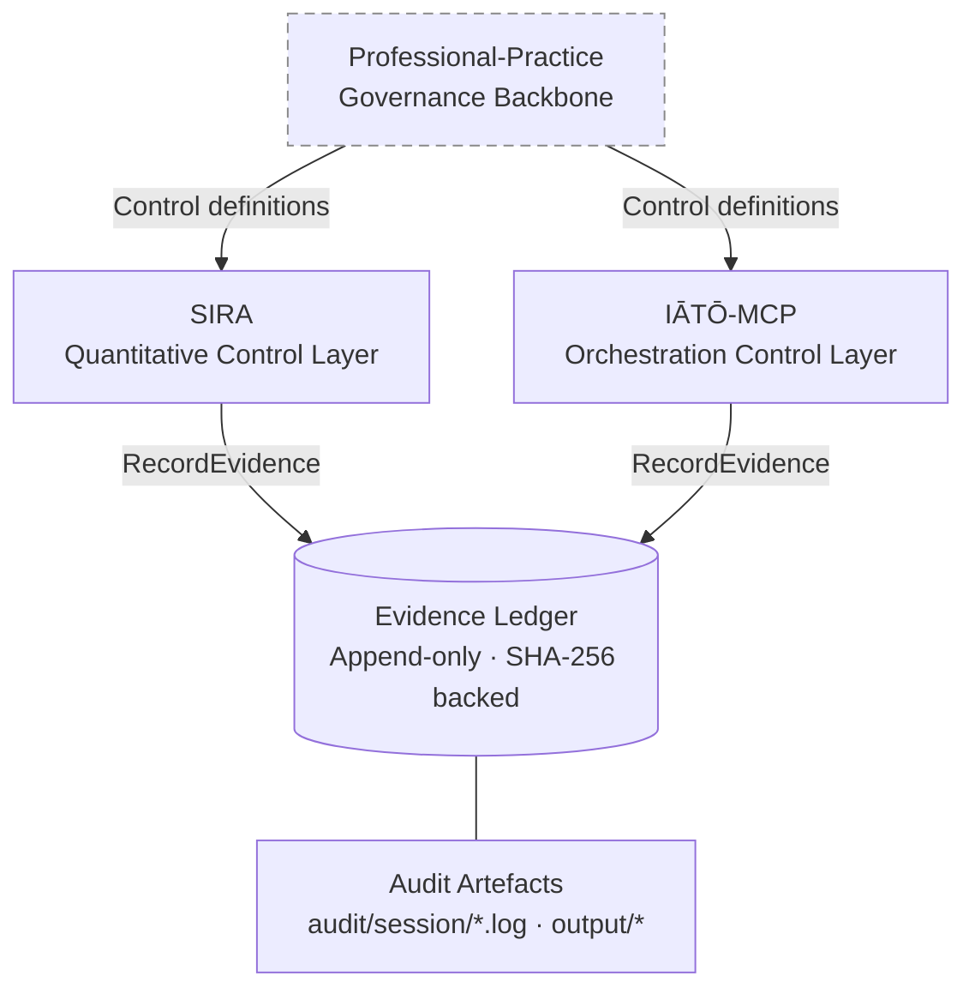
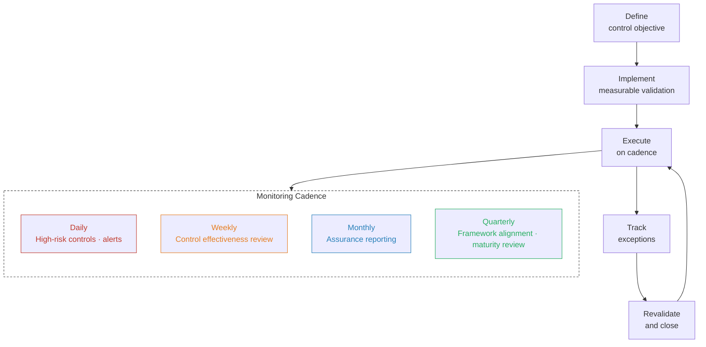

# IĀTŌ — Security Controls Index

<!--
Repository : IĀTŌ
Path       : README.md
Purpose    : Canonical entry document — control index, assurance programme, evidence model
Layer      : governance
Frameworks : ISM · ISO/IEC 27001:2022 · Essential Eight ML4 · Privacy Act 1988 (Cth)
Modified   : 2026-04-13
-->

> Operational security assurance index for engineering, platform, and model execution workflows.  
> ISM-aligned · ISO 27001:2022 · Essential Eight ML4 · Evidence-ledger backed · Audit-ready.

---

## Assurance Architecture

> Governing documents remain authoritative at Professional-Practice. This index is a dependent implementation layer and carries no independent governance authority. Assurance validity requires both controlled execution conditions and verifiable analytical outputs — neither layer is independently sufficient.

---

## Framework Alignment

| Framework | Issuing Authority | Type |
|---|---|---|
| Information Security Manual (ISM) | ACSC | Government security standard |
| Essential Eight (Maturity Level 4) | ACSC | Mitigation maturity model |
| ISO/IEC 27001:2022 | ISO/IEC | ISMS requirements standard |
| Privacy Act 1988 (Cth) + APPs | OAIC | Statutory obligation |

Not a certification artefact, assurance opinion, or audit substitute.

---

## Control Domains

| Domain | Prefix | Objective |
|---|---|---|
| Auditability | CTRL-AUD | Traceability and evidence integrity |
| Observability | CTRL-OBS | Telemetry and system visibility |
| Continuous Monitoring | CTRL-CON | Ongoing control validation |
| Governance | CTRL-GOV | Oversight and risk management |

---

## Controls Matrix

| Control ID | Control Objective | ISM | ISO 27001:2022 | E8 ML4 |
|---|---|---|---|---|
| CTRL-AUD-01 | Immutable audit logging | Event Logging | A.8.15, A.8.17 | ML4 |
| CTRL-AUD-02 | Change traceability | Change Management | A.8.32 | ML4 |
| CTRL-AUD-03 | Evidence retention | Records Management | A.5.33, A.5.34 | ML4 |
| CTRL-OBS-01 | Service telemetry | Monitoring | A.8.16 | ML4 |
| CTRL-OBS-02 | Alert integrity and fidelity | Incident Detection | A.5.25, A.8.16 | ML4 |
| CTRL-OBS-03 | Time synchronisation | Time Source Security | A.8.17 | ML3 |
| CTRL-CON-01 | Continuous control validation | Assessment | A.5.35, A.5.36 | ML4 |
| CTRL-CON-02 | Vulnerability management | Vulnerability Management | A.8.8 | ML4 |
| CTRL-CON-03 | Supply chain assurance | Provenance | A.5.19, A.5.20 | ML4 |
| CTRL-GOV-01 | Segregation of duties | Privileged Access | A.5.3, A.8.2 | ML4 |
| CTRL-GOV-02 | Exception governance | Risk Acceptance | A.5.20, A.6.1 | ML4 |
| CTRL-GOV-03 | Assurance reporting | Governance Oversight | A.5.35 | ML4 |

### SIRA-Control Extensions

| Control ID | Implementation Detail |
|---|---|
| CTRL-AUD-01 | Deterministic run audit with seeded outputs |
| CTRL-AUD-02 | Configuration traceability via TOML version control |
| CTRL-AUD-03 | Session log retention (`audit/session/*.log`) |
| CTRL-OBS-01 | Structured pipeline telemetry (stdout) |
| CTRL-OBS-02 | Scenario-based signal classification (SELL/HOLD/BREACH) |
| CTRL-CON-01 | Control coverage and gap register |
| CTRL-CON-03 | SHA-256 data manifest validation |
| CTRL-GOV-01 | Explicit non-goals register |
| CTRL-GOV-02 | Evidence gap register |
| CTRL-GOV-03 | Risk governance and challenge register |

---

## Evidence Model

### Core Evidence Types

| Artefact | Purpose | Retention | Owner |
|---|---|---|---|
| Control Design | Control specification | 7 years | Security Engineering |
| Execution Reports | Control validation results | 3 years | Platform/SRE |
| Change Records | Full change lifecycle trace | 7 years | Engineering |
| Incident Evidence | Response and remediation | 7 years | Security Operations |
| Access Reviews | Privilege validation | 7 years | IAM |
| Vulnerability Reports | Risk identification and remediation | 3 years | Security |

Retention periods are set against ISM record-keeping guidance and Privacy Act 1988 (Cth) APP obligations.

### SIRA Evidence Mapping

| Control | Artefact | Location |
|---|---|---|
| CTRL-AUD-01 | Session logs | `audit/session/*.log`|
| CTRL-AUD-02 | Config history | `config/sira.toml`|
| CTRL-AUD-03 | Compliance crosswalk | `docs/COMPLIANCE_CROSSWALK.csv`|
| CTRL-OBS-01 | Execution logs | `run_all.R`|
| CTRL-OBS-02 | Signal outputs | `output/*`|
| CTRL-CON-01 | Gap register | `docs/SIRA_EVIDENCE_GAP_REGISTER.md`|
| CTRL-CON-03 | Data manifest | `data/manifest/data_manifest.toml`|
| CTRL-GOV-01 | Non-goals register | `notebooks/*`|
| CTRL-GOV-02 | Risk register | `docs/RISK_COMMITTEE.md`|

---

## Evidence Gap Register

Tracked in `docs/SIRA_EVIDENCE_GAP_REGISTER.md`. Append-only via EvidenceService — manual edits are rejected at the reconciliation layer. CRITICAL items block release. HIGH items warn at validation.

| ID | Severity | Title | Control | Status |
|---|---|---|---|---|
| GAP-001 | HIGH | TLS chain validation incomplete | CTRL-OBS-01 | OPEN |
| GAP-002 | MEDIUM | ISO A.8.8 test coverage not evidenced | CTRL-CON-02 | OPEN |
| GAP-003 | LOW | Exception governance has no operator notification path | CTRL-GOV-02 | OPEN |

---

---

## Terminology

| Term | Definition |
|---|---|
| Assurance Case | Evidence-supported argument of system security |
| Auditability | Ability to reconstruct actions from records |
| Control Objective | Intended security outcome |
| Evidence Artefact | Verifiable proof of control operation |
| Residual Risk | Risk remaining post-control |
| Traceability | End-to-end linkage across controls and evidence |
| Binary Assertion | Pass/fail control state record |
| Provenance | Verifiable origin of artefacts |

---

## Reference

[ISM](https://www.cyber.gov.au/resources-business-and-government/essential-cyber-security/ism) · [Essential Eight](https://www.cyber.gov.au/resources-business-and-government/essential-cyber-security/essential-eight) · [ISO/IEC 27001:2022](https://www.iso.org/standard/27001) · [Privacy Act 1988 (Cth)](https://www.legislation.gov.au/Details/C2022C00199)
